# java并发

## thread与Runnable详解

    1. 两者关系
        * Thread类实现了Runnable接口

    2. Thread类

        <1> jdk官方解释

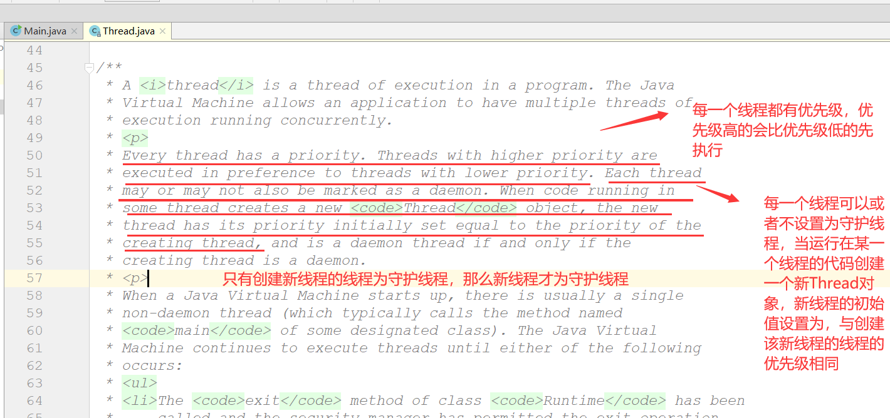

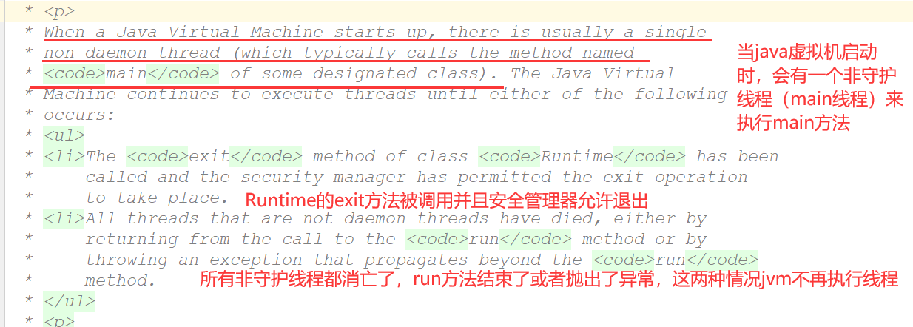

        <2> 创建线程的方式
            1) 继承Thread类

            2) 实现Runnable接口


        <3> 线程优先级
            * 线程优先级
                默认优先级为5，最小优先级为1，最大优先级为10

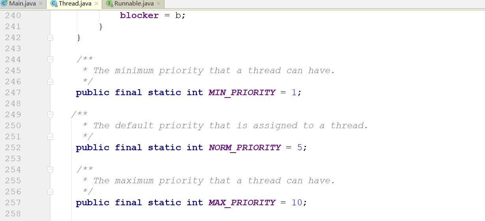

        <4> start方法详解

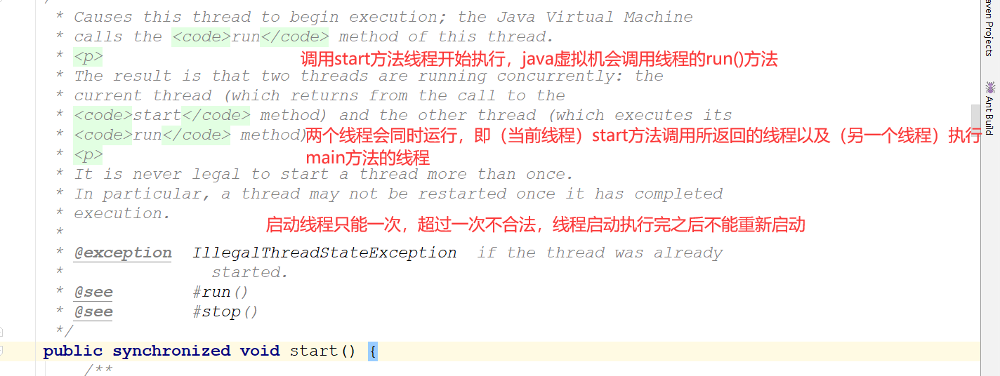

    3. Runnable接口

        <1> 接口描述（函数式接口中只有一个抽象的run方法）

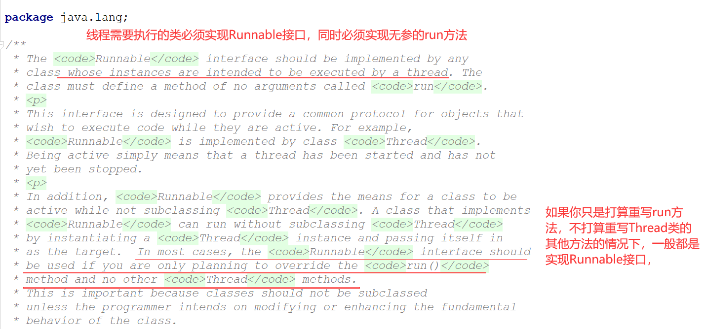

        <2> run方法描述

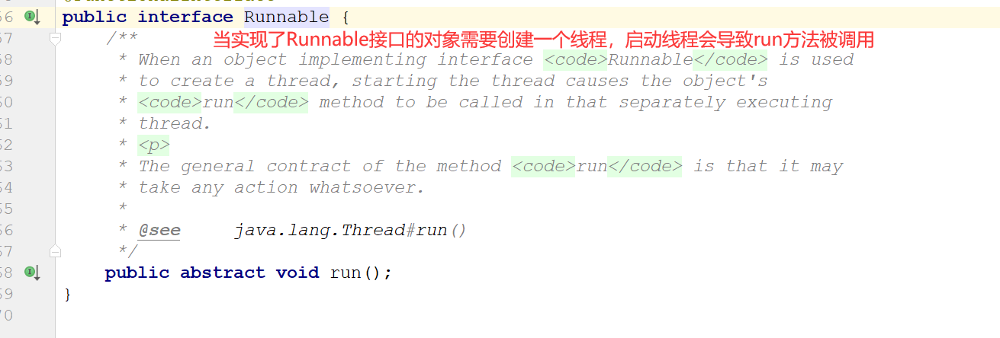

        
## wait与sleep的字节码分析

    1. wait方法详解

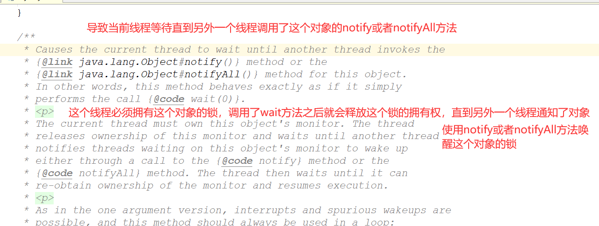

        <1> 要点：
            1) 要想调用wait方法，当前线程必须拥有这个对象的锁

            2) 线程调用了wait方法之后就会释放掉对象的锁，进入等待状态，等待到另外的线程通知在这个对象的锁上等待的
               所有线程，唤醒方式通过notify或者notifyAll方法 

            3) 线程会继续执行直到它可以获取到一个monitor锁的拥有权，然后继续向下执行

        <2> 案例演示：MyTest1

    2. sleep方法详解

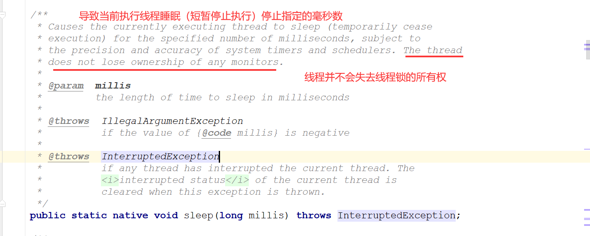

    3. sleep与wait的区别
        <1> wait方法被调用后会失去线程锁的拥有权，而sleep方法不会失去线程锁的拥有权


## notify方法及线程获取锁的方式详解

    1. 首先我们对wait(long timeout)方法进行详解

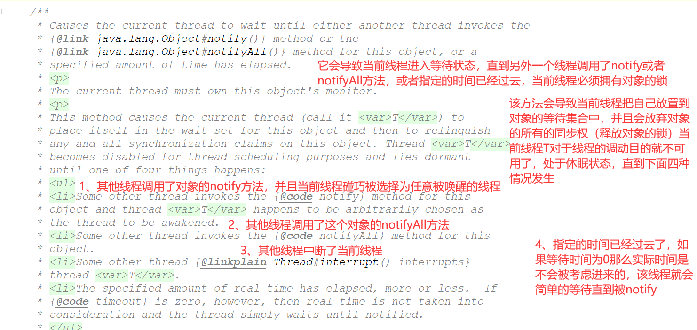

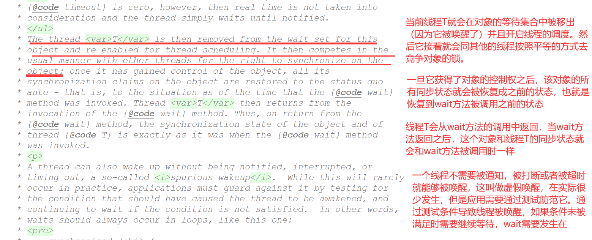

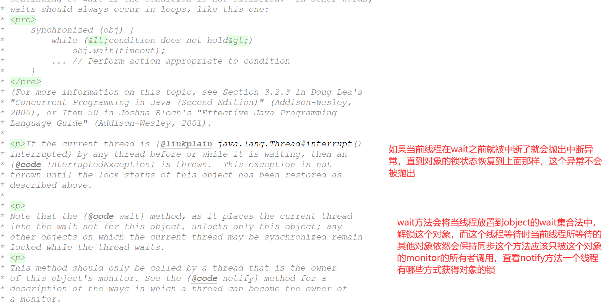

    2. notify与notifyAll

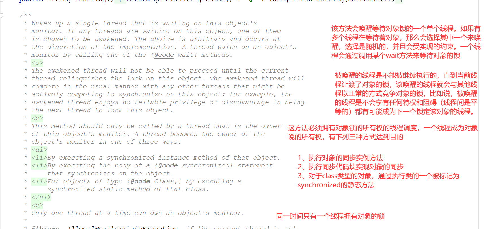

## wait&notify&notifyAll的总结

    1. 当调用wait方法时，首先需要确保调用了wait方法的线程已经持有了对象的锁

    2. 当调用了wait方法时，线程会释放该对象的锁，从而进入等待状态(wait-set)

    3. 当线程调用了wait方法进入等待状态时，它可以通过其它线程调用相同对象的notify或者notifyAll方法来使得
       自己被唤醒

    4. 一旦这个线程被其他线程唤醒后，该线程就会与其他线程一起竞争该对象的锁（公平竞争）只有当该线程获取到
       了这个对象的锁后，线程才会继续往下执行

    5. 调用wait方法的代码片段需要方法一个synchronized代码块或者synchronized修饰的方法中，这样才可以确保
       线程在调用wait方法前就已经获取到了对象的锁

    6. 当调用对象的notify方法时，它会随机的唤醒该对象等待集合中的任意一个线程，当某个线程被唤醒后，它就会
       与其他线程一起竞争对象的锁

    7. 当调用对象的notifyAll方法时，它会唤醒该对象等待集合中所有的线程，线程被唤醒之后，会竞争对象的锁

    8. 在同一时刻，只有唯一一个线程可以拥有对象的锁

## synchronized关键字详解及案例分析以及字节码分析
    1. 详细请参考test2案例

    2. 字节码分析synchronized(反编译test3中MyTest1)
        <1> 进入clasess目录执行javap

```
C:\Users\asus\Desktop\Computer_Learning_Notes\Java_Concurrency\java_Concurrency\target\classes>javap -v com.arbonkeep.concurrency.test03_synchronized.MyTest1
Classfile /C:/Users/asus/Desktop/Computer_Learning_Notes/Java_Concurrency/java_Concurrency/target/classes/com/arbonkeep/concurren
cy/test03_synchronized/MyTest1.class
  Last modified 2020-9-8; size 736 bytes
  MD5 checksum 16305471d8b1bde071b92d74845fdc0c
  Compiled from "MyTest1.java"
public class com.arbonkeep.concurrency.test03_synchronized.MyTest1
  minor version: 0
  major version: 51
  flags: ACC_PUBLIC, ACC_SUPER
Constant pool:
   #1 = Methodref          #2.#24         // java/lang/Object."<init>":()V
   #2 = Class              #25            // java/lang/Object
   #3 = Fieldref           #7.#26         // com/arbonkeep/concurrency/test03_synchronized/MyTest1.object:Ljava/lang/Object;
   #4 = Fieldref           #27.#28        // java/lang/System.out:Ljava/io/PrintStream;
   #5 = String             #29            // hello
   #6 = Methodref          #30.#31        // java/io/PrintStream.println:(Ljava/lang/String;)V
   #7 = Class              #32            // com/arbonkeep/concurrency/test03_synchronized/MyTest1
   #8 = Utf8               object
   #9 = Utf8               Ljava/lang/Object;
  #10 = Utf8               <init>
  #11 = Utf8               ()V
  #12 = Utf8               Code
  #13 = Utf8               LineNumberTable
  #14 = Utf8               LocalVariableTable
  #15 = Utf8               this
  #16 = Utf8               Lcom/arbonkeep/concurrency/test03_synchronized/MyTest1;
  #17 = Utf8               method
  #18 = Utf8               StackMapTable
  #19 = Class              #32            // com/arbonkeep/concurrency/test03_synchronized/MyTest1
  #20 = Class              #25            // java/lang/Object
  #21 = Class              #33            // java/lang/Throwable
  #22 = Utf8               SourceFile
  #23 = Utf8               MyTest1.java
  #24 = NameAndType        #10:#11        // "<init>":()V
  #25 = Utf8               java/lang/Object
  #26 = NameAndType        #8:#9          // object:Ljava/lang/Object;
  #27 = Class              #34            // java/lang/System
  #28 = NameAndType        #35:#36        // out:Ljava/io/PrintStream;
  #29 = Utf8               hello
  #30 = Class              #37            // java/io/PrintStream
  #31 = NameAndType        #38:#39        // println:(Ljava/lang/String;)V
  #32 = Utf8               com/arbonkeep/concurrency/test03_synchronized/MyTest1
  #33 = Utf8               java/lang/Throwable
  #34 = Utf8               java/lang/System
  #35 = Utf8               out
  #36 = Utf8               Ljava/io/PrintStream;
  #37 = Utf8               java/io/PrintStream
  #38 = Utf8               println
  #39 = Utf8               (Ljava/lang/String;)V
{
  java.lang.Object object;
    descriptor: Ljava/lang/Object;
    flags:

  public com.arbonkeep.concurrency.test03_synchronized.MyTest1();
    descriptor: ()V
    flags: ACC_PUBLIC
    Code:
      stack=3, locals=1, args_size=1            
         0: aload_0
         1: invokespecial #1                  // Method java/lang/Object."<init>":()V
         4: aload_0
         5: new           #2                  // class java/lang/Object
         8: dup
         9: invokespecial #1                  // Method java/lang/Object."<init>":()V
        12: putfield      #3                  // Field object:Ljava/lang/Object;
        15: return
      LineNumberTable:
        line 7: 0
        line 8: 4
      LocalVariableTable:
        Start  Length  Slot  Name   Signature
            0      16     0  this   Lcom/arbonkeep/concurrency/test03_synchronized/MyTest1;

  public void method();
    descriptor: ()V
    flags: ACC_PUBLIC
    Code:
      stack=2, locals=3, args_size=1
         0: aload_0
         1: getfield      #3                  // Field object:Ljava/lang/Object;
         4: dup
         5: astore_1
         6: monitorenter
         7: getstatic     #4                  // Field java/lang/System.out:Ljava/io/PrintStream;
        10: ldc           #5                  // String hello
        12: invokevirtual #6                  // Method java/io/PrintStream.println:(Ljava/lang/String;)V
        15: aload_1
        16: monitorexit
        17: goto          25
        20: astore_2
        21: aload_1
        22: monitorexit
        23: aload_2
        24: athrow
        25: return
      Exception table:
         from    to  target type
             7    17    20   any
            20    23    20   any
      LineNumberTable:
        line 11: 0
        line 12: 7
        line 13: 15
        line 14: 25
      LocalVariableTable:
        Start  Length  Slot  Name   Signature
            0      26     0  this   Lcom/arbonkeep/concurrency/test03_synchronized/MyTest1;
      StackMapTable: number_of_entries = 2
        frame_type = 255 /* full_frame */
          offset_delta = 20
          locals = [ class com/arbonkeep/concurrency/test03_synchronized/MyTest1, class java/lang/Object ]
          stack = [ class java/lang/Throwable ]
        frame_type = 250 /* chop */
          offset_delta = 4
}
SourceFile: "MyTest1.java"

```
        <2>分析详细过程（主要分析method方法）

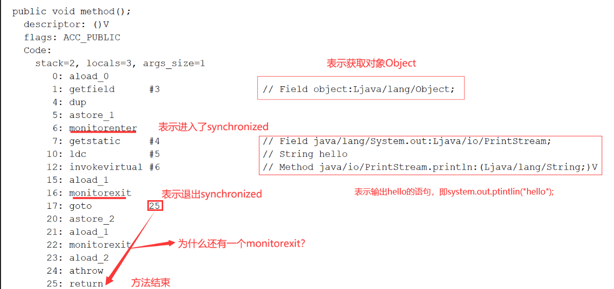        


## 同步方法访问标志与synchronized关键字的关系
    1. 程序一探讨，synchronized代码块，如下代码所示

        * 当我们进行反编译时，会发现下面代码中的两个方法，一个有两个monitorexit，一个有一个monitorexit，这是为什么呢？

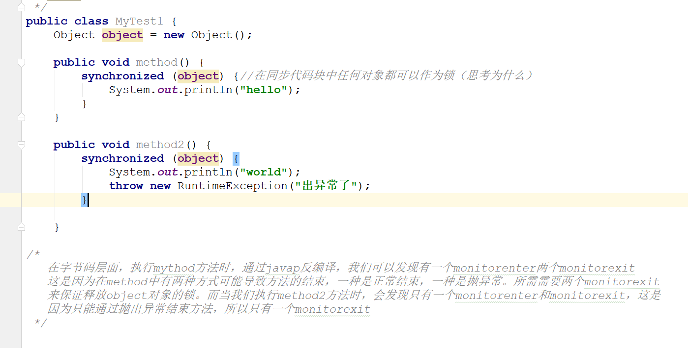  

    2. 程序二探讨，synchronized修饰方法，如下代码所示

        * 当我们进行反编译时，发现synchronized修饰方法并没有采用monitorenter与monitorexit指令的方式，而是使用了ACC-
          SYNCHRONIZED访问修饰符来修饰

        * JVM采用了ACC-SYNCHRONIZED访问标志来区分方法是否为一个同步方法，当方法被调用时，调用指令会检查该方法是否被
          ACC-SYNCHRONIZED修饰，如果是，那么线程将会先持有方法所在对象的Monitor对象，然后再去执行方法体，在方法执行
          期间其他线程无法获取该对象的Monitor对象，当方法执行完后，会释放掉这个对象的Monitor对象

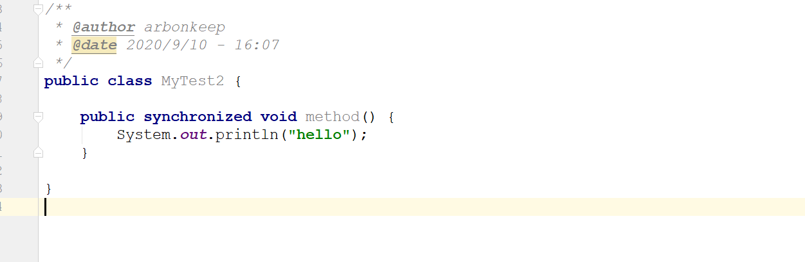 

    3. 程序三探讨，静态同步方法，如下代码所示

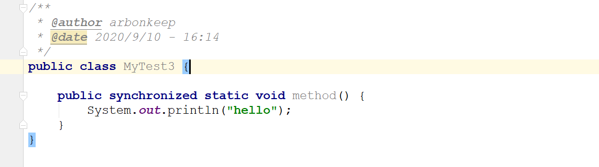 

        * 我们对上面程序进行反编译会发现，args_size=0，这是因为在static方法中是不存在this的，所以唯一的参数就消失了

 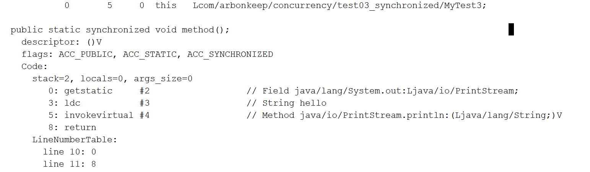

        * 当线程调用一个静态同步方法时，调用指令会检查是否有ACC-SYNCHRONIZED与ACC-STATIC标志，如果有，线程会持有该类
          的字节码对象的Monitor对象，然后后执行方法在方法执行期间其他线程无法获取该对象的Monitor对象，当方法执行完后，
          会释放掉这个对象的Monitor对象


## 自旋锁对于synchronized关键字的底层意义

    <1> JVM中的同步是基于进入与退出监视器对象（Monitor，也叫管程对象）来实现的，每个对象实例都会有一个Monitor对象。Monitor对象与java对象一同被创建或销毁。  Monitor对象是通过c++来实现的

    <2> 当多个线程访问一段同步代码时，这些线程会被放到一个EntrySet集合中，处于阻塞状态的线程都会被放置到该集合中。当线程获取到对象的Monitor时，Monitor是依赖于底层操作系统的mutexlock来实现互斥的，线程成功获取到mutex，只会持有该nutex，这时其它线程就无法再获取到该mutex

    <3> 如果线程调用了wait方法，那么该线程就会释放掉所有的mutex，并且该线程会进入WaitSet集合（等待集合）中，等待下一次被其他线程调用notify或者notifyAll方法唤醒，如果当前线程顺利执行完毕，那么他也会释放掉所持有的metux

    <4> 同步锁在这种实现方式当中，因为Monitor是依赖于底层操作系统实现，所以存在用户态与核心态之间的切换，会增加性能开销。通过对象互斥锁来保证共享数据操作的完整性。每个对象读对应于一个可称为“互斥锁”的标记，这个标记用于在任何时刻，只有一个线程访问该对象。那些处于EntrySet与WaitSet中的线程均处于阻塞状态，阻塞操作是由操作系统来完成的，在linux下是通过pthread_mutex_lock函数来实现的。线程被阻塞后便会进入到内核调度状态，会导致用户态与内核态之间的切换，严重影响锁的性能。

    <5> 要想解决该问题，那么就需要使用自旋锁（Spin）来解决。原理是：当发生Monitor的争用时，若持有者能够在很短时间内释放掉锁，则那些正在争用的线程就会稍微等待一下（即所谓的自旋）在持有者线程释放锁之后，争用线程可能会立刻获取到锁，从而避免了系统阻塞。不过当持有者运行的时间超过了临界值后，争用线程自旋一段时间后仍然无法获取到锁，这时争用线程会停止自旋而进入到阻塞状态。所以总体思想是：先自旋，不成功再进行阻塞，尽量降低阻塞的可能性，这对于那些执行时间很短的代码来说有很大的性能提升。显然，自旋在多处理器（多核心）上才有意义。
