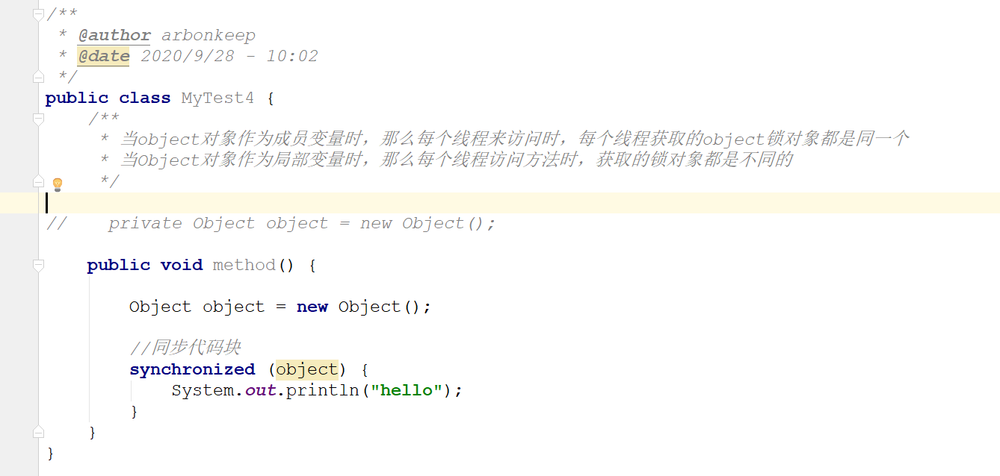
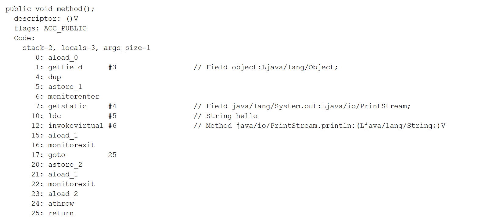
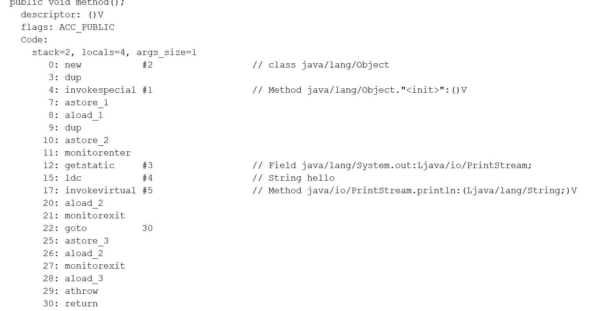
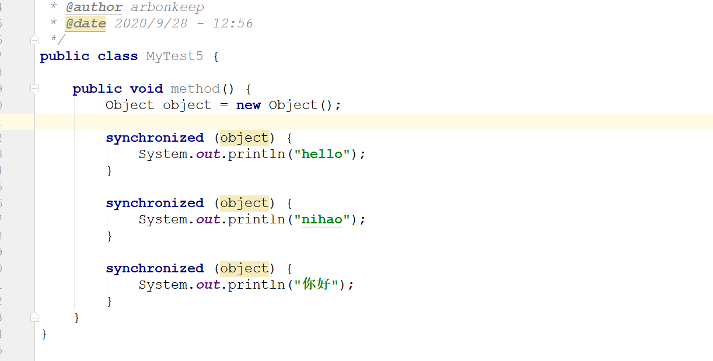
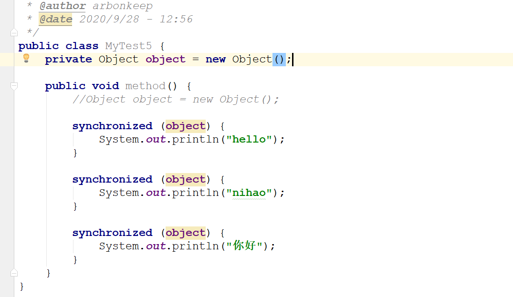
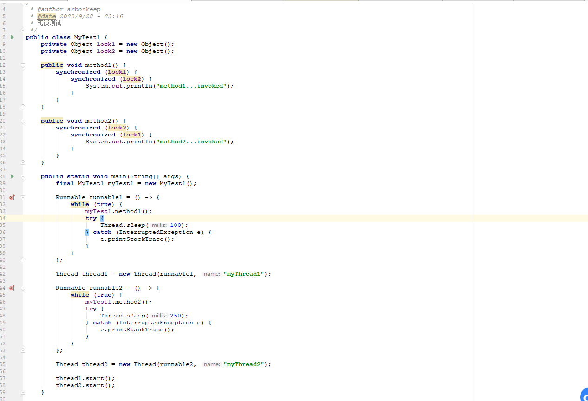
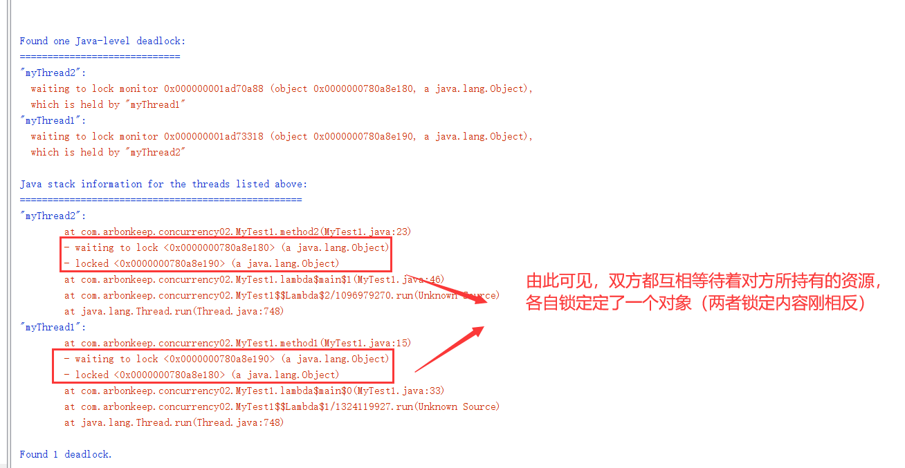
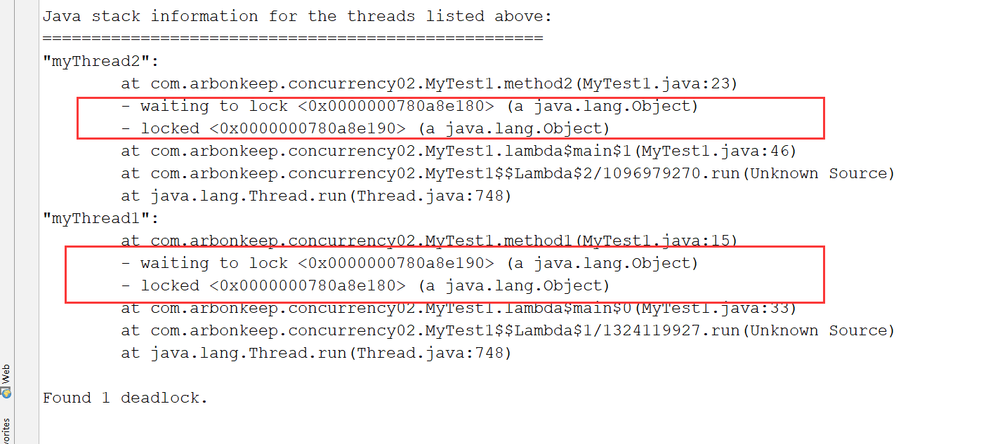

# java并发

## 锁升级与偏向锁的分析

    1. 在JDK1.5之前，如需要实现线程同步，那么只能通过使用synchronized关键字来实现。在底层，Java也是通过synchronized
        关键字来实现数据的原子性维护的，synchronized关键字是JVM实现的一种内置锁，从底层角度来说，这种锁的获取与释放都
        是由JVM来帮助我们隐式实现的。

    2. 从JDK1.5开始，并发包下引入了Lock锁，Lock同步锁是基于Java来实现的，因此锁的实现与释放都是通过Java代码来实
       现的。然而synchronized是基于底层操作系统的Mutex Lock来实现的，每次对锁的获取与释放动作都会引起用户态与核
       心态之间的切换，这种切换会导致系统的开销增大，在并发量较高时，也就是在锁的竞争比较激烈的时候，synchronized
       锁在性能上的表现是极差的。

    3. 直到JDK1.6，synchronized锁发生了巨大的改变。JVM引入了相应的优化手段来提升synchronized锁的性能，这种提升
       涉及到偏向锁、轻量级锁以及重量级锁等，从而减少锁的竞争带来的用户态与核心态之间的切换，这种锁的优化实际上是通过
       Java对象头中的一些标志来实现的，对于锁的访问与改变都是与Java对象头息息相关的。

    4. 从JDK1.6开始，对象实例在堆当中划分为三个组成部分：对象头，实例数据以及对齐填充。

    5. 其中对象头由三部分组成：
        <1> Mark word
            * 记录了对象、锁以及垃圾回收的相关信息，在64位的JVM中，Mark Word的长度为64bit。

            * 组成部分
                1) 无锁标记

                2) 偏向锁标记

                3) 轻量级锁标记

                4) 重量级锁标记

                5) 垃圾回收标记

        <2> 指向类的指针

        <3> 数组的长度

    6. 锁的升级
        <1> 对于synchronized锁来说，锁的升级主要是通过Mark Word中的标志位与是否是偏向锁标志位来达成的，synchronized
            关键字所对应锁都是先从偏向锁开始，随着锁竞争的不断升级，逐步演化为轻量级锁，最后则变成了重量级锁。

        <2> 对于锁的演化来说，它会经历如下阶段：
            无锁    ->      偏向锁      ->      轻量级锁        ->      重量级锁


## 轻量级锁与重量级锁的变化深入详解

    1. 偏向锁
        <1> 偏向锁是针对于一个线程来说，它的主要作用就是优化同一个线程多次获取一个锁的情况，如果是一个synchronized
            方法被一个线程访问，那么这个方法所在的对象就会在Mark Word中将偏向锁进行标记，同时还会用一个字段来存储该
            线程的id，当这个线程再次访问同一个synchronized方法时，它会检查这个对象的Mark Word的偏向锁标记以及是否
            指向了该线程的id，如果是的话，那么该线程就不必再进入管程（Monitor），而是直接进入该方法体中。

        <2> 在基于上面情况下，就是说，synchronized锁已经成为一个偏向锁，如果该线程再次进入了该synchronized方法，
            线程正在synchronized方法中执行的时候，还没有执行完，那么就会取消偏向锁，升级为轻量级锁。如果该线程执行
            完毕，那么其他线程会进入该方法，同样的偏向锁也会被取消。

    2. 轻量级锁
        <1> 若第一个线程已经获取到当前对象的锁，这时第二个线程又开始争抢该对象的锁，由于该对象的锁已经被第一个线程获
            取到，所以该锁为偏向锁，而第二个线程在争抢时，会发现该对象头中的Mark Word已经是偏向锁，但是里面存储的id
            并不是自己(是第一个线程)，那么它会进行CAS（Compare and Swap）从而获取到锁。这时会产生两种情况：

            1) 获取锁成功：那么它会直接将Mark Word中的线程id由第一个变成自己（偏向锁标志为保持不变），这样该对象依
               然会保持偏向锁的状态。

            2) 获取锁失败：表示这时可能有多个线程同时在尝试争抢该对象的锁，那么这是偏向锁会进行升级，升级为轻量级锁。

    3.自旋锁
        <1> 当发生monitor的争用时，若owner能够在很短时间内释放掉锁，则哪些争用的线程就可以稍微等待一下（即自旋），
            在owner线程释放掉锁之后，争用线程可能会立刻获取到锁，从而避免了系统的阻塞，不过当持有者线程运行的时间
            超过了临界值后，争用线程自旋后依然无法获取到锁，这时争用线程则会停止自旋进入到阻塞状态。总体思路：先自
            旋，不成功就进行阻塞，尽量降低阻塞可能性，这对于执行时间短的代码有极大的性能提升，自旋在多处理器上才有
            效果。

        <2> 若自旋失败（依然无法获取到锁），那么锁就会转化为重量级锁，在这种情况下，无法获取到锁的线程都会进入到
            Monitor。

        <3> 自旋锁最大的特点就是避免线程从用户台进入到核心态。


## 锁粗化与锁消除技术的详解（编译器对于锁的优化措施）

    1. 锁消除技术

        <1> 概念：
            JIT编译器(Just In Time，即时编译器)可以在动态编译同步代码时，使用一种叫做逃逸分析的技术，通过该项技术
            来判别程序中所使用的锁对象是否被一个线程所使用，而没有散布到其他线程中，如果是这样的话，那么即时编译器
            在编译这个同步代码块时，不会生成synchronized关键字所标识的锁的申请与释放机器码，从而消除了锁的使用流程

        <2> 分析：
            1) 如下程序所示，



            2) 我们对成员变量位置的Object对象的锁对象进行反编译，查看method方法得到如下内容
                    成员变量的位置，也就是说所有的线程都会共享这个object



            3) 同样的，我们对局部变量位置的object对象的锁对象进行反编译，查看method方法得到如下内容

                    局部变量的位置，就是说每个线程都是独立的object，也就时说，每个线程使用的object都不是同一个，
                    这也就意味着我们使用synchronized代码块修饰是没有意义的（但是很多时候，程序员会加上）。此时编
                    译器就会进行优化，也就是相当于没有加上synchronized去修饰。

                    总结：表面上看，依然是被同步代码块修饰的，但是实际上底层是没有的（反编译的字节码文件依然存在
                    monitorenter与monitorexit，在真正运行时JIT编译器就会消除锁）



    2. 锁粗化技术
        <1> 概念：每一个synchronized块都对应着一个monitorenter和两个monitorexit，JIT编译器在执行动态编译时会对
            下面代码进行优化，若发现前后相邻的synchronized块使用的是同一个锁对象，那么它就会把这几个synchronized
            块合并为一个较大的同步块，这样做的好处在域于线程在执行这些代码时，就无需繁琐的申请与释放锁了，从而达到
            申请与释放锁一次，就可以执行完全部的同步代码块，从而提升了性能。

        <2> 分析：

            1) 首先我们查看下面代码，局部变量的情况

    

            2) 我们对上面代码进行反编译，发现，有三个monitorenter和六个moniterexit 这是正常的。实际上会JIT编译
               器会进行锁的消除，实际上都没有上锁   

```
 public void method();
    descriptor: ()V
    flags: ACC_PUBLIC
    Code:
      stack=2, locals=6, args_size=1
         0: new           #2                  // class java/lang/Object
         3: dup
         4: invokespecial #1                  // Method java/lang/Object."<init>":()V
         7: astore_1
         8: aload_1
         9: dup
        10: astore_2
        11: monitorenter
        12: getstatic     #3                  // Field java/lang/System.out:Ljava/io/PrintStream;
        15: ldc           #4                  // String hello
        17: invokevirtual #5                  // Method java/io/PrintStream.println:(Ljava/lang/String;)V
        20: aload_2
        21: monitorexit
        22: goto          30
        25: astore_3
        26: aload_2
        27: monitorexit
        28: aload_3
        29: athrow
        30: aload_1
        31: dup
        32: astore_2
        33: monitorenter
        34: getstatic     #3                  // Field java/lang/System.out:Ljava/io/PrintStream;
        37: ldc           #6                  // String nihao
        39: invokevirtual #5                  // Method java/io/PrintStream.println:(Ljava/lang/String;)V
        42: aload_2
        43: monitorexit
        44: goto          54
        47: astore        4
        49: aload_2
        50: monitorexit
        51: aload         4
        53: athrow
        54: aload_1
        55: dup
        56: astore_2
        57: monitorenter
        58: getstatic     #3                  // Field java/lang/System.out:Ljava/io/PrintStream;
        61: ldc           #7                  // String 你好
        63: invokevirtual #5                  // Method java/io/PrintStream.println:(Ljava/lang/String;)V
        66: aload_2
        67: monitorexit
        68: goto          78
        71: astore        5
        73: aload_2
        74: monitorexit
        75: aload         5
        77: athrow
        78: return

```
            3) 然后我们对代码进行改造，如下所示

 

            4) 然后对改造后的代码进行反编译，结果也是和上面一致的，但是此时是真正的上锁了。也就是没有进行锁的消除，
               如果按照上面的顺序执行，那么程序执行消耗的资源是十分多的，要连续的获取与释放锁。由于三个连续的同步代码
               块在一起，所以即时编译器就会进行优化，将它们合并为一个大的同步代码块，这也就是我们上面介绍的锁粗化。


## 死锁检测与相关工具详解

    1. 相关概念
        <1> 死锁：线程1等待线程2互斥持有的资源，线程2也在等待线程1互斥持有的资源，两个线程都无法继续执行

        <2> 活锁：线程持续重试一个失败的操作，导致无法继续执行

        <3> 饥饿：线程一直被调度器延迟访问其依赖以执行的资源，也许是调度器先于低优先级的线程而执行高优先级的线程可以
                  执行，同时总是会有一个高优先级的线程可以执行，饿死也叫无限延迟

    2. 死锁程序编写
        <1> 程序如下所示

 

        <2> 此时，我们开始执行，并使用jvisualvm查看死锁状况，将死锁dump之后的情况如下

 

        <3> 使用jps 查看程序运行的pid（jps -l），并使用jstack查看死锁的情况
            其实，我们使用jstack查看到的内容与jvisuavm是一样的

 

  


