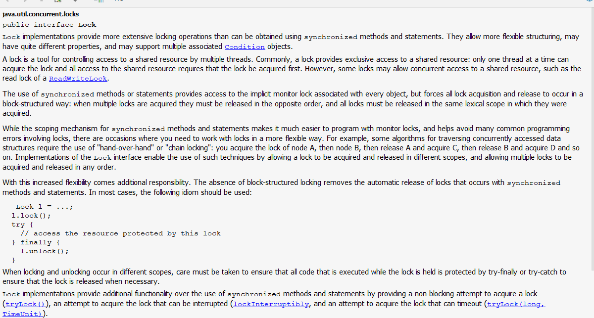

# Java并发

## Lock锁机制深入详解

    1. Lock锁机制中java.util.concurrent.locks下的Lock类的文档注释分析

        <1> 使用IDEA的ctrl + q提取该类的文档注释，部分文档注释如下:

        <2> 文档注释翻译：
            Lock锁的实现所提供的可扩展功能要远远超过synchronized方法以及synchronized方法块所提供的功能，它们支持
            更多灵活的结构化，会有相当多不同的属性，并且可能支持更多的有联系的Condition对象。

            锁是一个用来控制被多线程对于同一个共享资源访问的工具，通常情况下，一个锁对于一共享的资源会提供排他性的
            访问：即同一时间只有一个线程能够获取到这把锁并且对于共享资源其它线程的访问都需要首先获取到这把锁，然而
            一些锁可能允许并发访问一个共享资源，例如，ReadWriteLock中的读锁。

            同步方法或者同步代码块的使用提供了与每个对象关联的隐式监视器的访问，但是它强制所有的锁的获取与释放必须
            以一个块结构的方式发生：当多个锁被获取时，它们必须以一个相反的顺序得到释放，而且所有的锁必须在它们所获
            取相同的范围中进行释放。

            虽然synchronized方法和语句块的范围机制使得带监视器锁的程序变得更加简单，并且有助于避免很多与锁相关的
            编码上的错误，但是有一种场景你需要使用一种更加灵活的方式来使用锁。例如：一些用于并发遍历访问数据结构的
            算法需要使用“hand-over-hand”或者链式锁：你需要获取A节点的锁，然后获取B节点，然后再释放A接待你，并获
            取C节点，然后再释放B节点，获取D节点等（这与通常情况不同，一般使用锁是先获取A，再获取B，接着释放B，然
            后释放A）Lock接口的具体实现使得技术的使用允许在不同的范围内获取和释放锁，并且允许多个锁以任意一种顺序
            来获取与释放

            随着灵活性的增加，责任也随之增加。块结构锁的缺失消除了同步方法和语句发生的锁的自动释放。在大多数情况下，
            应使用以下习惯用法：

            当上锁与解锁发生在不同的范围时，必须注意确保在锁定期间执行的所有代码都受到try finally或try catch的保
            护，以确保在必要时释放锁。

            Lock实现相比于synchronized方法和语句块来说提供了额外的功能：通过提供一个非阻塞的尝试(tryLock())来获
            取锁，并且还提供一个可以被中断的获取锁的尝试(tryLock(long,Timeunit))

    2. 知识点补充
        <1> 在实际情况中，大部分都是读的操作，小部分是写的操作，如果几个线程对资源进行读的操作，显然是不需要上锁
            (不会改变内容)但是，有时可能是写的操作，就需要上锁了。java中提供了ReadWriteLock(读写锁)解决这个问题

