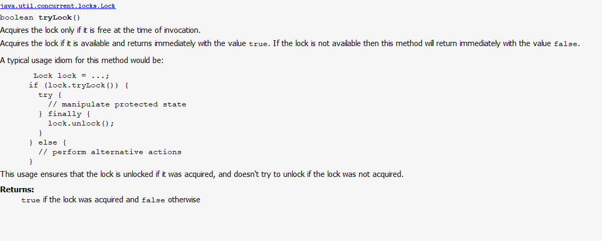
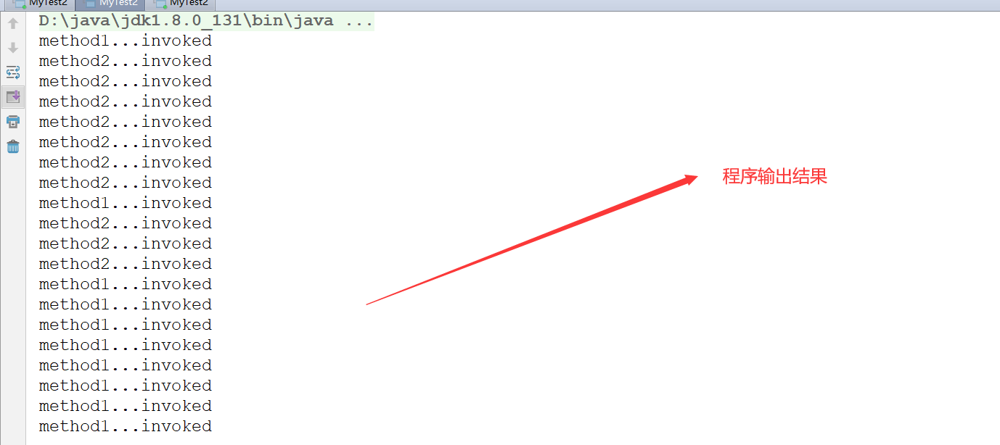
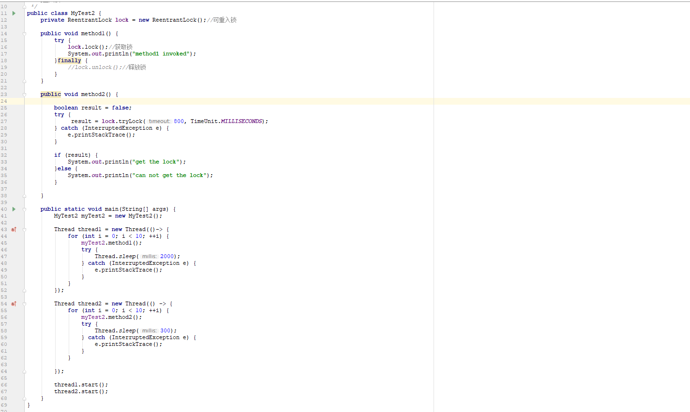

# Java并发

## Lock锁机制深入详解

    1. Lock锁机制中java.util.concurrent.locks下的Lock类的文档注释分析

        <1> 使用IDEA的ctrl + q提取该类的文档注释，部分文档注释如下:

        <2> 文档注释翻译：
            Lock锁的实现所提供的可扩展功能要远远超过synchronized方法以及synchronized方法块所提供的功能，它们支持
            更多灵活的结构化，会有相当多不同的属性，并且可能支持更多的有联系的Condition对象。

            锁是一个用来控制被多线程对于同一个共享资源访问的工具，通常情况下，一个锁对于一共享的资源会提供排他性的
            访问：即同一时间只有一个线程能够获取到这把锁并且对于共享资源其它线程的访问都需要首先获取到这把锁，然而
            一些锁可能允许并发访问一个共享资源，例如，ReadWriteLock中的读锁。

            同步方法或者同步代码块的使用提供了与每个对象关联的隐式监视器的访问，但是它强制所有的锁的获取与释放必须
            以一个块结构的方式发生：当多个锁被获取时，它们必须以一个相反的顺序得到释放，而且所有的锁必须在它们所获
            取相同的范围中进行释放。

            虽然synchronized方法和语句块的范围机制使得带监视器锁的程序变得更加简单，并且有助于避免很多与锁相关的
            编码上的错误，但是有一种场景你需要使用一种更加灵活的方式来使用锁。例如：一些用于并发遍历访问数据结构的
            算法需要使用“hand-over-hand”或者链式锁：你需要获取A节点的锁，然后获取B节点，然后再释放A接待你，并获
            取C节点，然后再释放B节点，获取D节点等（这与通常情况不同，一般使用锁是先获取A，再获取B，接着释放B，然
            后释放A）Lock接口的具体实现使得技术的使用允许在不同的范围内获取和释放锁，并且允许多个锁以任意一种顺序
            来获取与释放

            随着灵活性的增加，责任也随之增加。块结构锁的缺失消除了同步方法和语句发生的锁的自动释放。在大多数情况下，
            应使用以下习惯用法：

            当上锁与解锁发生在不同的范围时，必须注意确保在锁定期间执行的所有代码都受到try finally或try catch的保
            护，以确保在必要时释放锁。

            Lock实现相比于synchronized方法和语句块来说提供了额外的功能：通过提供一个非阻塞的尝试(tryLock())来获
            取锁，并且还提供一个可以被中断的获取锁的尝试(tryLock(long,Timeunit))

    2. 知识点补充
        <1> 在实际情况中，大部分都是读的操作，小部分是写的操作，如果几个线程对资源进行读的操作，显然是不需要上锁
            (不会改变内容)但是，有时可能是写的操作，就需要上锁了。java中提供了ReadWriteLock(读写锁)解决这个问题

## Lock锁方法原理详解

    1. 接着上一节内容，我们继续读Doc文档

        <1> 文档内容如下所示

        <2> 文档翻译
            Lock类也能提供与隐式监视锁完全不同的行为和语义，比如保证顺序，不可重入的使用或者死锁检测。如果实现提供
            特殊的语句，那么该实现就必须以文档的形式出现。

            请注意，Lock实例只是普通对象，它们本身可以用作同步语句（synchronized语句）中的目标。获取Lock实例的监
            视器锁与调用该实例的任何锁方法没有指定关系。为了避免混淆，建议永远不要使用这种方式获取Lock实例，除非在
            它们自己实现的底层当中

            除非另有说明，否则为任何参数传递null值都将导致抛出NullPointerException

            内存同步

            所有Lock锁实现必须强制执行与内置监视器锁提供的相同的内存同步语义，如Java语言规范(17.4内存模型)中所述：

                1) 一个成功的lock操作与一个成功的Lock动作拥有相同的内存同步的效果

                2) 一个成功的unlock操作与一个成功的unlock动作有相同的同步效果

                3) 不成功的锁定和解锁操作，和可重入的锁定和解锁操作是并不需要内存同步效果的

            实现上的考量

            lock获取的三种形式（可中断的，不可中断的，基于时间的）在性能特征、排序保证或其他实现质量方面可能有所
            不同。进一步说，中断正在获取锁的能力可能不在指定的Lock类中。因此，在以上三种锁的获取上面并不要求精准
            的实现相同的保证和语义，也不要求在锁获取上支持中断，该实现被要求清晰的记录语义并要保证是每一个锁定的
            方法所提供的。还要遵循定义在该接口中的语义，以支持所获取的中断程度，要么完全中断，要么只在方法入口中断

            由于中断是可以被取消的，所以检查中断的操作是不频繁的，所以实现可以优先响应中断而不是常规方法返回。这也
            是正确的：即使可以表明中断会出现在另一个操作之后导致线程解锁该线程，实现应该记录这种行为

    2. Lock类的方法详解
        <1> lock()方法解读

            1) 文档如下：

            2) 文档翻译：
                如果lock获取不到锁，当前线程则无法进行线程调度，并处于休眠状态(一直等待)直到lock能被获取到

                锁实现可以检测锁的错误使用，例如会导致死锁的调用，并可能在这种情况下抛出（未检查的）异常。环境和
                异常类型必须由该锁实现记录。

        <2> lockInterruptibly()方法

            1) 文档如下：

            2) 文档翻译
                获取lock，除非当前线程被中断了。如果锁获取到了则方法会立刻返回。流过这个锁不可用，那么当前线程
                则会变得不可以进行线程调度，此时就会阻塞，会导致下面两件事发生：

                    * 锁被当前线程获取

                    * 或者其它线程打断了当前线程，并且锁的中断是被支持的

                如果当前线程：
                    * 中断状态，设置在方法的入口上，
                    * 或者lock正在获取时被中断了并且该锁获取的中断是被支持的
                
                那么中断异常就会被抛出，并且当前线程的中断状态就会被清除

                在某些实现中，中断锁获取的能力可能是不可能的，如果可能的话，可能是一个昂贵的操作。程序员应该意识
                到这可能是事实。在这种情况下，实现应该记录下来。

                与普通方法返回相比，实现更倾向于响应中断。

                锁实现可以检测锁的错误使用，例如会导致死锁的调用，并可能在这种情况下抛出（未检查的）异常。环境和异
                常类型必须由该锁实现记录。

        <3> tryLock()方法

            1) 文档如下：

        

            2) 文档翻译

                在调用的时候该锁空闲就可以获取到锁，如果可以获取到锁，该方法就会立刻返回true，而如果锁获取不到，
                那么就立刻返回false，典型用法：

                这种方式确保了如果获取到了锁才会去解锁，如果没有获取到锁就不会进行解锁
    
        <4> tryLock(long time,@NotNull TimeUnit unit)方法

            1) 文档如下：

      

            2) 文档翻译

                如果在给定的等待时间内锁是空闲的并且当前线程没有被中断的情况下则获取到锁，如果能获取到锁则立马
                返回true，而如果没有获取到锁，那么当前线程阻塞导致下列三件事发生：

                * 正常获取到锁

                * 当前线程被其他线程打断了，并且锁获取的中断是被支持的

                * 指定的等待时间到了

                如果获取到锁则返回true，如果当前线程，在进入此方法时设置其中断状态；或获取锁时中断，支持锁获取
                中断，然后抛出InterruptedException并清除当前线程的中断状态
                如果指定的等待时间已过，则返回false。如果时间小于或等于零，则该方法根本不会等待

                实现考量

                在某些实现中，中断锁获取的能力可能是不可能的，如果可能的话，可能是一个昂贵的操作。程序员应该意
                识到这可能是事实。在这种情况下，实现应该记录下来。

                实现可以优先响应中断而不是普通方法返回，或者报告超时。

                锁实现可以检测锁的错误使用，例如会导致死锁的调用，并可能在这种情况下抛出（未检查的）异常。环境
                和异常类型必须由该锁实现记录。

        <5> unlock()方法

             1) 文档如下：

        

            2) 文档翻译
                锁实现通常会对线程释放锁施加限制（通常只有锁的持有者才能释放锁），如果违反了限制，则可能会抛
                出（未检查的）异常。任何限制和异常类型都必须由该锁实现记录。

        <6> newCondition()方法

            1) 文档如下：

        

            2) 文档翻译
                返回一个绑定了这个Lock实例的一个新的Condition实例。
                在等待条件之前该锁必须要被当前线程持有，对于Condition.await的调用将会在等待之前释放掉锁，并
                且在wait方法返回之前重新获取到这个锁

                Condition实例的确切操作取决于锁实现，并且必须由该实现记录。

                 
## Lock与synchronized关键字在底层的区别以及详细分析

    1. 首先，我们测试一个程序。
        <1> 程序如下所示：

 

        <2> 对于程序的分析
            * 对于上面程序，我们运行后，会在控制台将method1...invoked和method2...invoked各输出十次，但是执行
              顺序是由线程来控制的，总之结果是正常的输出情况。
              
            * 结果如下

    2. 然后我们将程序进行稍微的改造
        <1> 程序如下所示（我们将method1中的unlock方法注释掉）

        <2> 对程序运行分析
            * 此时，运行结果只会在控制台输出10次method1...invooked。这是因为在method1中我们获取到lock一直没有
              释放，当第二个线程执行method2时获取不到lock所以只能执行method1。那么为什么会执行十次呢？这是因为
              我们使用的是可重入锁（也就是同一个线程获取到锁后，第一次执行方法时，一直没有释放，该线程再次执行方
              法时，能够再次获取到锁，能够进入该方法完成执行）

            * 结果如下

    3. 程序接着改造
        <1> 程序如下所示（我们将method1的unlock注释，将method2中的内容进行修改，method2中不使用lock()方法而
            是使用tryLock()方法）

        <2> 程序运行结果分析
            * 此时，运行结果控制台是能输出method1和method2的内容，但是method2中不能获取到锁，因此只会输出can
              not get lock，这是因为tryLock是有返回值的，不管能不能获取到锁都会返回结果

    4. Lock与synchronized关键字在锁处理上的区别
        <1> 锁的获取方式：Lock是通过程序代码的方式由开发者手工获取(使用lock或tryLock)，synchronized时通过JVM
            来获取(无需开发者干预)

        <2> 具体实现方式：Lock是通过Java代码来实现，synchronized是通过JVM底层来实现(无需开发者关注)

        <3> 锁的释放方式：Lock必须通unlock()方法在finally块中释放，synchronized通过JVM来释放(无需开发者关注)

        <4> 锁的具体类型：Lock提供了多种类型，如：公平锁，非公平锁，Lock和synchronized都提供了可重入锁

    5. Lock中涉及的公平锁与非公平锁
        * ReentrantLock中的公平锁与非公平锁

