# Java并发

## Condtion详解及相对于传线程并发模式的改进

    1. 传统的并发模式与jdk1.5之后引入Condition的并发模式的对比
        
        <1> 两者对比
            1) 传统上，程序员使用synchronized关键字 + wait() + notify()/notifyAll()方法来实现多个线程之间的协调
               与通信，整个过程都是由JVM来帮助我们实现的，开发者无需（也无法）了解底层的实现细节

            2) 从JDK1.5开始，并发包提供了Lock，Condition(await()与signal()/signalAll())来实现多个线程之间的协调
               与通信，整个过程都是由开发者来控制的，而且相比于传统方式，更加灵活，功能也更加强大

        <2> 两者关联分析
            其中Lock相当于synchronized，Condition相当于Object，await()相当于wait()，signal/signalAll相当于
            notify/notifyAll，值得注意的是Lock和Condition是java实现的，而synchronized相关的内容是通过底层JVM实
            现的

    2. 对于了解详细的Condition之前，我们需要了解一下Lock中的newCondition()方法(参考之前Lock类分析)

    3. 在了解了两者对比之后，我们即将对Condition进行深入分析
        
        <1> 关于Condition的文档分析
            
            1) Condition接口的部分doc文档如下所示

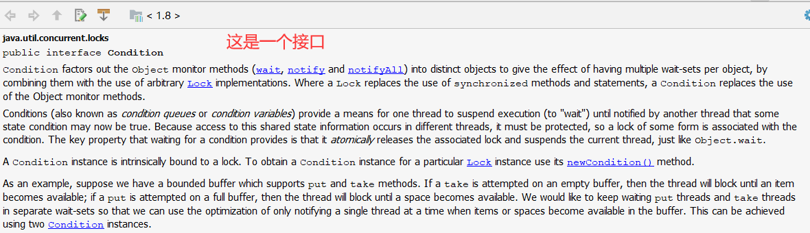

        <2> 文档翻译

            Condition是将Object的监视器方法如wait，notify和notifyAll放置在不同的对象中了，达到的效果就是每个对象
            会有多个等待集合。

 <p style="padding-left:80px">    <!--整段缩进 -->
<font color=red>
            <b>解释说明：</b><br>
            也就是说使用Condition的话等待集合可以有多个。加入有5个线程，可以将第1个线程放在第一个等待集合，将第2,3 <br>
            个线程放置在第二个等待集合。。。而对于Object.wait()wait而言所有的线程只能存于当前对象的同一个等待集合之<br>
            中。总而言之，Condition相对来说比较灵活。
</font>   
</p>

            是通过使用任意Lock实现将其进行合并。Lock替换了synchronized方法和代码块的使用。一个Condition替换了对象
            监听方法的使用。

            Condition(也被叫做条件队列或条件变量)针对一个线程提供了挂起执行(等待状态)的一种方式，直到被某些状态条件
            变为true的线程所通知。由于对于共享状态信息的访问时发生在不同的线程中，所以必须是受保护的，如此某种形式的
            一个Lock一定会关联到一个条件上，等待一个条件的关键属性是它会自动释放掉关联的lock，并且会挂起当前线程，这
            就像Object中的wait()

            一个Condition实例会被天然的绑定到一个Lock上，要想获得一个特定的Lock实例对应的Condition实例的话需要时候
            用Lock中的newCondition()方法

            举个例子，假如我们有一个有界的缓冲区支持put(放入)和take(获取)方法。如果一个take尝试从一个空的缓冲区中获
            取元素，该线程则会阻塞，直到里面有一个新的条目，如果一个put尝试往一个满的缓冲区中放，则线程也会阻塞直到有
            一个空闲空间可用为止。我们将让保持等待状态的put线程和take线程放在不同的waitSet(等待集合)中，以便于我们
            能够使用一种优化：在缓存中的条目或空间变得可用时，能够单独通知一个线程。这可以通过两个Condition实例来实现

            例子如下：

``` java
class boundedBuffer {
    final Lock lock = new ReentrantLock();
    final Condition notFull = lock.newCondition();
    final Condition notEmpty = lock.newCondition();

    final Object[] items = new Object[100];
    int putptr, takeptr, count;//count表示元素个数

    public void put(Object x) throws InterruptedExcption {
        lock.lock();
        try {
            whilem(count == items.length)//如果元素满了即count=100
                notFull.await();//等待，调用该方法会释放lock
            items[putptr] = x;
            if (++putptr  == items.length) putptr = 0;
            ++count;
            notEmpty.signal();//唤醒其他线程，通知其他线程可以来获取元素
        }finally {
            lock.unlock();
        }
    }

     public Object take() throws InterruptedException {
       lock.lock();
       try {
         while (count == 0)
           notEmpty.await();
         Object x = items[takeptr];
         if (++takeptr == items.length) takeptr = 0;
         --count;
         notFull.signal();//用于唤醒put的await
         return x;
       } finally {
         lock.unlock();
       }
     }  


}
```
            在阅读了上述例子之后，我们将它与synchronized块或者方式实现的代码进行对比:

``` java

public class MyObject {
    private int counter;
    //声明增加的方法
    public synchronized void increase() {
        //如果counter是大于0的那么就需要进行--操作，就让线程进入休眠
        if (counter != 0) {
            try {
                wait();
            } catch (InterruptedException e) {
                e.printStackTrace();
            }
        }
        counter++;
        System.out.println(counter);
        notify();//调用notify唤醒等待队列线程
    }
    //声明减少的方法
    public synchronized void decrease() {
        //如果等于0的话，那么就需要进入休眠状态
        if (counter == 0) {
            try {
                wait();
            } catch (InterruptedException e) {
                e.printStackTrace();
            }
        }
        counter--;
        System.out.println(counter);
        notify();
    }

}
```

<p style="padding-left:80px">
<font color=red>
            <b>结果：</b><br>
            使用Condition是可以获取多个Condition实例，也就是说可以有多个的condition实例调用await()和signal(),而使
            用<br>synchronized只能使用当前对象调用wait()和notify()，这就是之前所说的Condition的功能较强大
</font>
</p>
        
## Condition编程模式详解与分析

    1. 接着读之前还没有读完的文档
        <1> 关于Condition部分文档的分析

            1) 部分文档如下

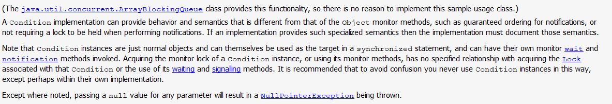

            2) 文档翻译
            
                java.util.concurrent.ArrayBlockingQueue类提供了上述例子的功能，因此没有必要自己实现上面例子的类。
                (我们可以自己实现一下来增强理解)

                一个Condition实现能够提供跟Object监视器方法不同的行为及语义，比如对于通知的确定性的排序，或者在执行
                通知时不会要求持有一把锁。如果一个实现提供了像这样详细的语义，那么一定要在文档中记录下来

                注意Condition实例只是一个普通的对象，并且自己也能用作synchronized块或方法的目标，而且还拥有自己的监
                视器的wait和notification方法可以被调用。获得一个Condition实例的监视器锁，或者用自身监视器的自带的方
                法，在获取Condition的锁和用自身的wait()和notify()方法没有任何关系。推荐的做法是永远不要使用这样的方
                式使用Condition来避免混淆，除非有可能是在自身实现中

                除了特殊说明之外，给任何参数传null都会空指针异常


        <2> 部分文档分析

            1) 部分文档如下

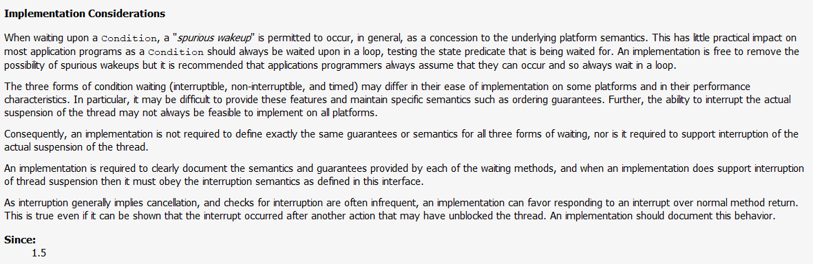

            2) 文档翻译
                当等待在一个条件变量时，一个“假唤醒”是允许发生的一般情况下，是作为底层平台的一种语义。这种情况在大多
                数的应用程序中是没有什么影响的，因为一个Condition总是在一个循环中等待的，测试这种等待的条件是否被满
                足了。一个实现是可以自由移除这种假唤醒，但是推荐做法是应用程序员应该总是假设这会发生，并且总是放在循
                环之中。

<p style="padding-left:80px">
<font color=red>
            <b>解释说明：</b><br>                
                “假唤醒”，是指我们没有调用notify进行唤醒等待线程，该线程很可能是由系统唤醒的。
</font>
</p>

                在一些特定的平台上的实现和性能特性，Condition waiting的三种形式(可中断的，不可中断的，和超时的)可
                能不一样。特别的，可能很难去提供这些特性和维护具体的语义，比如说在顺序保证上，更进一步，在所有平台上
                中断真实线程得挂起能力可能不是很灵活就能实现的。

                因此实现针对等待的这三种形式并不要求精确的定义，相同的保证或语义，并且也不要求对于真实线程的挂起是
                支持的。

                对于实现是要求在文档中记录由每个等待方法所提供的语义和保证，并且当实现并不支持线程挂起的中断时，它
                必须遵循定义在这个接口中的中断语义。

                由于中断通常也暗示着一种取消，并且检查中断也不是一个频繁的操作，实现可以正常的响应一个中断而非一个
                正常的方法返回，即使一个中断发生在另一个动作之后并不会阻塞这个线程是真的，就需要将其实现在文档中的
                详细记录下来。


## Condition方法实现与分析

    1. 在了解了Condition的详细的文档内容后，接下来将对Condition类中的方法进行进一步的了解。

        <1> await()方法

            1) doc文档如下

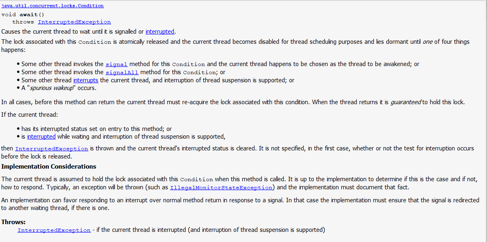

            2) 翻译说明
                会导致当前线程等待，直到它被其它线程通知唤醒或者被中断了。

                与Condition关联的锁会自动释放掉，并且当前线程会进入到休眠状态无法进行调度，直到以下四种情况发生
                才会导致这种情况解除：

                    * 当某个其它线程调用了Condition.signal()方法，碰巧当前线程成为被唤醒线程

                    * 其它线程调用了Condition.signalAll()方法

                    * 其它线程中断了当前线程，并且线程的挂起中断是被支持的

                    * 发生假唤醒

                在所有情况下，在该方法返回之前，当前线程必须重新获取与此Condition相关联的锁。当线程返回了那么就
                确保已经获取到该锁了。

                如果当前线程：
                    * 当进入该方法时，就已经设置了中断状态，或者

                    * 当处于等待并且支持线程挂起的中断，被打断了
                
                此时就会出现中断异常，并且当前线程的中断状态会被清除掉。在第一种情况下，没有规定是否在释放锁之前
                进行中断测试。

                当前线程在这个方法被调用的时候要确保持有与Condition相关联的锁。这是有具体的实现来确定是否满足这
                种条件，如果不满足，该如何应对。典型的，异常被抛出(如:IllegalMonitorStateException),实现必须
                要将这个事实记录下来。

                实现也可以响应一个中断而不是通常的为了响应一个通知的方法返回，在这种情况下，实现也要确保这个信号
                被重定向到另一个等待线程，如果有的情况下。

        <2> awaitUninterruptibly()方法

            1) doc文档如下

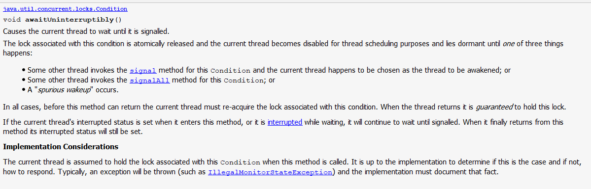

            2) 翻译说明(大部分内容与await一致，只是将中断部分删除)

                该文档中只有三种情况会解除无法调度的休眠状态。去除了中断

        <3> awaitNanos(long nanosTimeout)方法

            1) doc文档如下

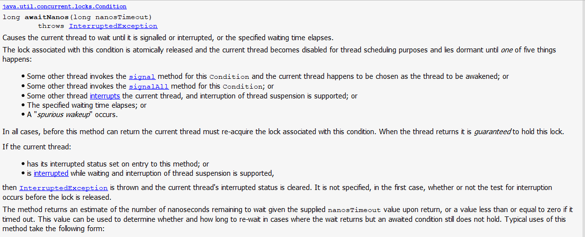   

            2) 翻译说明(大部分内容与await一致，主要查看不同内容即主要对第二副图中的内容进行解释)

                * 对于await()方法而言，本方法有5中情况会解除无法调度的休眠状态。增加了一个内容：超过指定的等待
                  时间

                这个方法的返回值是一个近似指定纳秒剩余纳秒数(即如果我们指定了500ns，在等待了200ns后，那么该方
                法的返回值就是300ns)，或者在超时时，会返回小于或等于0的值。这个值可用于确定在等待返回但等待的
                条件仍不成立的情况下是否重新等待以及重新等待多长时间。典型的，会采用如下方式：

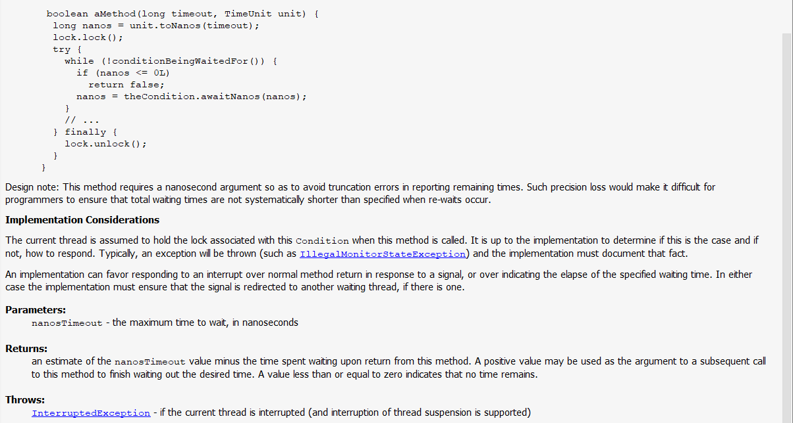

                设计上的说明：这个方法需要传一个纳秒的参数是为了在报告剩余时间上避免阶段的错误，这样的精度损失
                将使程序员很难确保在重新等待发生时，总等待时间不会系统地短于指定的时间。

                当调用此方法时，假定当前线程持有与此条件关联的锁。由实现来决定是否是这样，如果不是，如何响应。
                通常，会抛出一个异常（例如IllegalMonitorStateException），并且实现必须记录该事实。

                一个实现可以优先响应中断而不是响应信号的常规方法返回，或者超过指示指定等待时间的过去。无论哪种
                情况，实现都必须确保信号被重定向到另一个等待线程（如果有）。

        <4> await(long time, TimeUnit unit)方法

            1) doc文档如下

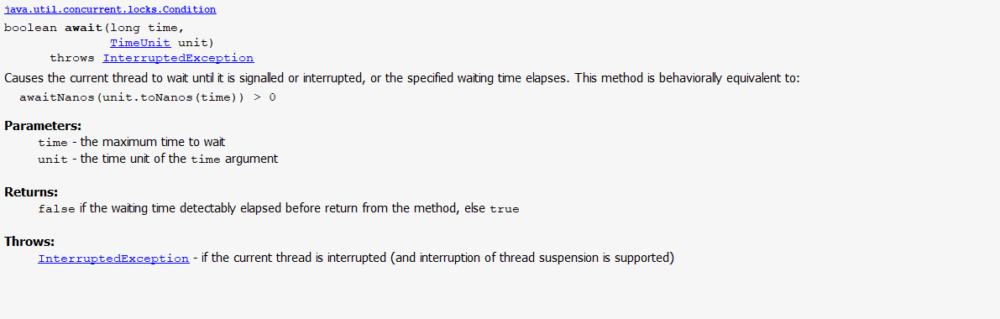   

            2) 翻译说明（等价于awaitNanos方法）

                使当前线程等待，直到发出信号或中断，或指定的等待时间过去。这种方法在行为上等同于：
                awaitNanos(unit.toNanos(time)) > 0

        <5>  awaitUntil(@NotNull Date deadline)方法

             1) doc文档如下(此方法指定一个具体的日期时间，其余与await相似)

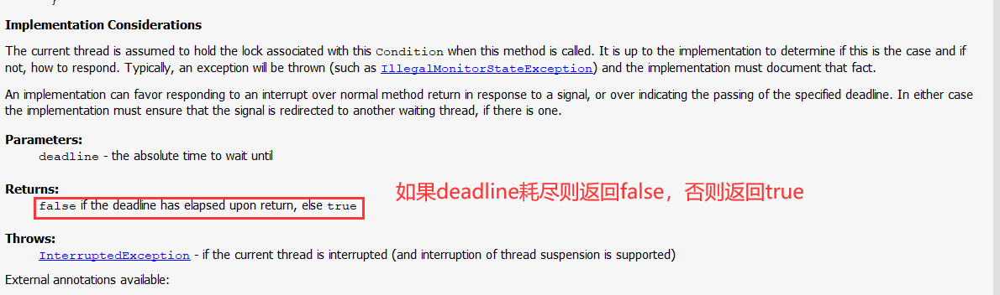   

        <6> signal()方法
                
            1) doc文档如下

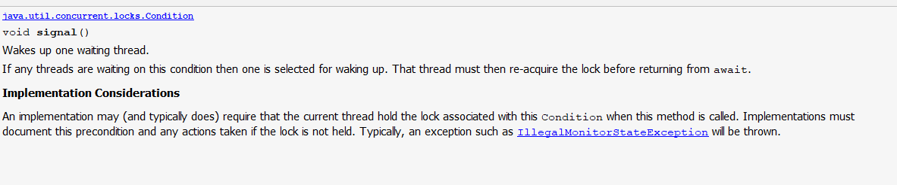   

            2) 翻译说明

                唤醒一个正在等待的线程(底层是一个单向链表，会唤醒第一个等待的线程)

                如果多个等待线程在这个条件上，则其中一个会被选择唤醒。那么该线程必须在await返回之前重新获取这个锁。

                实现(典型情况也是如此)会要求这个方法被调用时，当前线程必须持有Condition相关联的锁。如果该锁没有
                获取，则实现上必须将这种前置条件和任何行为都给记录下来，典型的，将会抛出IllegalMonitorStateExc
                eption

        <7> signalAll()方法
            1) doc文档如下

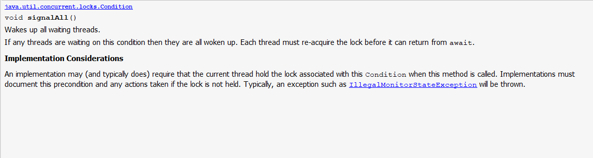   

            2) 翻译说明

                唤醒所有等待的线程。

                如果有线程在此条件下等待，那么它们都将被唤醒。每个线程必须重新获取锁，然后才能从await返回。

                当调用此方法时，一个实现可能（通常是这样）要求当前线程持有与此条件相关联的锁。实现必须记录此前
                提条件以及在未持有锁的情况下所采取的任何操作。通常，会抛出一个异常，比如IllegalMonitorStateE
                xception。