# java并发

##  JMM和happen-before的规则

    1. JMM(Java Memory Model) Java 内存模型

    2. happen-before与JMM的问题
        <1> 变量的原子性问题

        <2> 变量的可见性问题

        <3> 变量修改时的时序性问题

        happen-before的概念:所谓happen-before就是指它前面的内容总是先于它后面的内容执行。如A happen-before B 
        那么就是指A在B之前执行

    3. Happen-before的重要规则
        <1> 顺序执行规则(限定在单线程)：执行线程的每一个动作都hppen-before它后面的动作

        <2> 隐式锁规则：unlock happen-before lock ,之前线程对于同步代码块的所有执行结果对于后续获取锁的线程来说都是可
            见的

        <3> volatile读写规则：对于一个volatile变量的写操作一定会happen-before后续对改变量的读操作

        <4> 多线程启动规则：Thread对象的start方法happen-before该线程中run方法的任何一个动作，包括在其中启动的任何子线
            程

        <5> 多线程的终止规则：一个线程启动了一个子线程，并且调用了子线程的join方法等待其结束，那么当子线程结束后，父线
            程接下来的所有操作都可以看到子线程run方法的执行结果

        <6> 线程的中断规则：可以调用interrupt方法来中断线程，这个操作是happen-before对该线程的中断检查(interrupted)


## CountDownLatch使用场景与示例分析
    1. 引入问题：
        有两个线程，一个线程必须在另外一个线程执行完成所有任务之后才能继续往下执行，可以如何实现呢？

        解决方案：
            使用Thread类中的join方法可以实现。

        此刻，问题又来了，如果在一个特定的条件下，如以下条件：有一个主服务，其下面包含着5个子服务，那么如何实现在这五个
        之服务执行到一半时（或者其他特定条件）则可以通知主服务向下执行呢？

        那么，此时我们就不能使用join来实现了。因为join只是在完成所有任务之后才能够通知父服务进行执行

        解决方案：
            使用CountDownLatch即可完成该需求

    2. 查看CountDownLatch的描述
        意思是一个同步辅助，允许一个或多个线程去等待，直到在其他线程中一组操作执行完成为止。（这就符合我们的需求）


    3. 程序示例编写

```java
public class MyTest01 {

    public static void main(String[] args) {
        //创建CountDownLatch
        //参数3，表示线程在调用wait()之前，必须调用countDown()的次数（3次）
        CountDownLatch latch = new CountDownLatch(3);
        //创建3个线程
        IntStream.range(0,3).forEach(i -> new Thread(() -> {
            try {
                Thread.sleep(2000);
                System.out.println("111111");
            }catch (Exception e){
                e.printStackTrace();
            }finally {
                //调用countDown,latch必须要在finally中调用，确保出异常也能调用到
                latch.countDown();
            }
        }).start());
        //此刻子线程执行完毕
        System.out.println("子线程执行完毕啦。。。。");
        try {
            latch.await();
        }catch (Exception e) {
            e.printStackTrace();
        }
        System.out.println("主线程执行完毕啦。。。。");
    }
}

```
    4. 上述程序分析
        <1> 首先，我们对引用计数器（也就是countDown中的参数）进行分析。
            1) 就上述程序而言，只要调用了一次countDown()方法，那么改参数就会减1。而在上述例子中我们设置的参数与我们创
               建的线程数保持一致，也就是说，最终计数器会变为0。在变为0之后，计数器不会继续向下减。

        <2> 前面提到了计数器，那么计数器的作用是什么呢?
            1) 在调用coutDownLatch.await()方法时会检测计数器的值。如果计数器的值大于0，那么调用await()的线程就会进
               入阻塞状态。计数器等于0了则该await()立刻返回

            2) 也就是说，如果我们在创建对象时，指定参数为4，那么最终计数器的值为1，调用的子线程就会进入阻塞状态


            3) 运行结果一致处于阻塞状态，导致最后的主线程没有执行


        <3> 回到之前程序，查看结果，这样的结果貌似使用Thread.join()也能实现，实际并非如此，如果我们在添加后续代码
            那么join()就实现不了。因为join()必须在所有内容执行完才能通知调用主线程


    3. 详解CoutDownLatch

        <1> await()方法详解
            1) 底层是调用sync的方法，该类继承了AQS。详细的内容不在进行描述，感兴趣的可以继续探讨


        <2> 对于await()方法还有一个重载的方法await(long timeout, TimeUnit unit)。该方法的作用是在上述情况中如果
            count>0会阻塞，而该方法表示在到达指定的时间后，阻塞结束，会继续向下执行

## CyclicBarrier透彻分析
    1. CyclicBarrier使用场景
        <1> 假设有4个线程，只有当4个线程都到达了内存屏障之后才会开始执行。也就是说，如果线程1到达了，那么线程1会阻塞
            线程2，线程3也是如此,只有当线程4，即最后一个线程到达内存屏障，那么这4个线程才会一起冲破屏障，继续执行。


        <2> 在了解了CyclicBarrier的使用场景之后，我们将它与CoutDownLatch进行一个对比
            1) CoutDownLatch是有主线程和子线程之分的，而CyclicBarrier没有主线程与子线程之分

            2) 两者都有计数器这个东西，但是CoutDownLatch的计数器在减到0后，不会重置。而CyclicBarrier的计数器在减到
               0后，会重置。(即如果count为4，当4个线程到达内存屏障执行后，count会重新置为4)

    2. CyclicBarrier源码注释

        <1> CyclicBarrier描述


    3. 程序例子
        <1> 例子如下所示

```java

public class MyTest02 {
    public static void main(String[] args) {
        //创建CyclicBarrier
        CyclicBarrier cyclicBarrier = new CyclicBarrier(4);
        //该参数代表线程数量，必须在障碍被释放之前调用await方法
        //创建3个线程
        for (int i = 0; i < 4; i++) {
            new Thread(() -> {
                try {
                    Thread.sleep((long) (Math.random() * 2000));
                    Random random = new Random();
                    int result = random.nextInt(500);
                    System.out.println("AAA" + result);
                    cyclicBarrier.await();
                    System.out.println("BBB" + result);
                }catch (Exception e) {
                    e.printStackTrace();
                }
            }).start();
        }
    }
}

```

        <2> 运行结果
            1) 此结果，再输出时，控制台会出先以下情况：首先前面的都是一个一个慢慢输出，当AAA324出现后，立刻下面的内容
               全部输出。这就是因为要等到最后一个线程到达后才会一次性冲破屏障的结果


        <3> 分析  cyclicBarrier.await();    此处以上述例子为例
            1) 有两层含义：
                * 先检测障碍前是否有4个线程，如果没有就会进入阻塞

                * 如果检测到有4个线程，那么这四个线程就会冲破障碍然后执行

    4. 例子改进
        <1> 改进如下

```java

public class MyTest02 {
    public static void main(String[] args) {
        //创建CyclicBarrier
        CyclicBarrier cyclicBarrier = new CyclicBarrier(4);
        //该参数代表线程数量，必须在障碍被释放之前调用await方法
        //创建3个线程
        for(int j = 0 ; j < 2; j++) {
            for (int i = 0; i < 4; i++) {
                new Thread(() -> {
                    try {
                        Thread.sleep((long) (Math.random() * 2000));
                        Random random = new Random();
                        int result = random.nextInt(500);
                        System.out.println("AAA" + result);
                        cyclicBarrier.await();
                        System.out.println("BBB" + result);
                    }catch (Exception e) {
                        e.printStackTrace();
                    }
                }).start();
            }
        }
    }
}

```

        <2> 运行结果如下


    5. CyclicBarrier的第二个构造方法，传递一个Runnable对象

        <1> 如下所示


        <2> 运行结果
            
            * 查看结果，我们可以得出结论：该构造方法的Runnable对象会在所有线程冲破屏障向下执行之前执行


## CyclicBarrier底层源码剖析与Condition的使用详解
    1. CyclicBarrier的底层执行流程:
        <1> 初始化CyclicBarrier中的各种成员变量，包括parties、count和Runnable(可选)
 
        <2> 当调用await()方法时，底层会先检查计数器count是否归零，如果是的话，那么首先会先执行Runnable，接下来就会
            开始下一个分代(generation)
         
        <3> 在新的分代中，会将计数器count重新赋值为parties(指定的参数)，并创建新的generation实例

        <4> 同时会调用Condition中的singnalAll方法，唤醒所有在屏障前面等待的线程，让其开始继续执行

        <5> 如果计数器没有归零，那么当前的调用线程将会通过Condition的await()方法，在屏障前进行等待

        <6> 以上所有执行流程均在lock锁（ReentrantLock）的控制范围，不会出现并发情况
            
## CAS详解及透过字节码分析变量操作的原子性
    1. synchronized关键字与Lock锁都是属于悲观锁。而我们需要学习的CAS则是乐观锁的一种实现

        <1> 悲观锁：顾名思义，就是一种很悲观的锁，它认为任何情况下都会出现多线程问题，所以首先会对操作进行一个上锁操作
                    这样来确保所有的操作都是由这一个线程来执行的

        <2> 乐观锁：乐观的认为，只有它一个线程对内容进行操作，也就说它不会做任何的预先操作。那么，这样就会有两种情况发
                    生：一种是一直到最后都只有它一个线程来操作，这样能正常执行完。还有一种就是在它完成操作之前有其它线
                    程对该内容进行修改，这样就引发了多线程的问题。

                    为此，为了保证能够正常执行，在执行更新的时候，就需要一种机制来确保当前操作的内容没有被其它线程进行
                    修改。此时CAS就是用于解决该问题的。CAS就是乐观锁的一种重要实现。

    2. CAS:Compare And Swap(比较和交换)

        <1> CAS有两种情况
            1) 首先会对变量进行比较，会将当前线程持有变量的值与实际变量的值进行比较，如果相等，那么就说明没有被其它线程
                进行修改，那么就会进行下一个步骤：交换。也就是将变量的值赋予一个新的值。

            2) 同样的，首先会对变量进行比较，会将当前线程持有变量的值与实际变量的值进行比较，如果不相等，那么就说明这个
                变量的值被其它线程修改了。就会进行重试，也就是重新将改变量最新的值读取过来，然后再次比较和交换，这是一
                个循环的过程，直到变量的值被修改成功为止

        <2> 问题来了，CAS是两个操作比较和交换，那么它是如何保证操作的原子性的呢？
            CAS本身是由硬件指令来提供支持的，也就是说，硬件中是通过一个原子指令来实现比较与交换的，因此CAS可以确保变量
            操作的原子性。

    3. 通过字节码来了解变量操作的原子性

        <1> 简单程序

```java

public class MyTest1 {

    private int count;

    public int getCount() {
        return count;
    }
    //进行+1的操作
    public void increase() {
        this.count++;
    }

}

```
        <2> 直接反编译javap -v 查看字节码文件

            1) 运行javap -v target/classes/com/arbonkeep/concurrency04/MyTest1.class

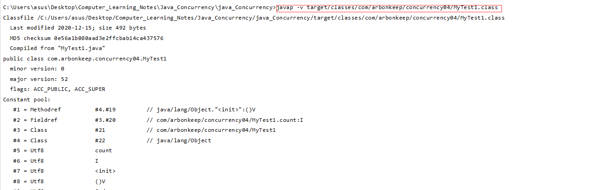

            2) 查看increase方法
                查看下列字节码可知，实现赋值的操作需要使用到4条指令，辣么也就是说，这个操作不是原子性的

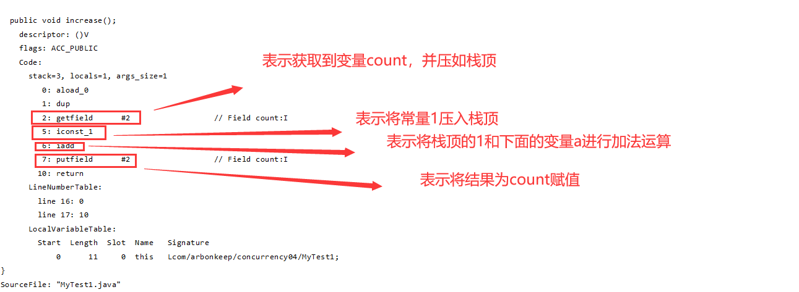

            3) 为了保持原子性，我们尝试为两个方法加上synchronized关键字，这样就实现了原子操作。


```java

public class MyTest1 {

    private int count;

    public synchronized int getCount() {
        return count;
    }
    //进行+1的操作
    public synchronized void increase() {
        this.count++;
    }

}

```

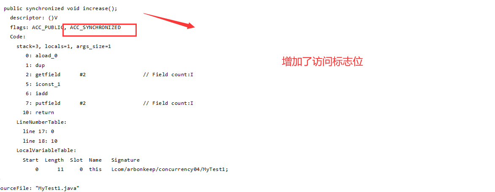

            4) 上述加上synchronized关键字的方法可以实现原子性，但是它的性能受到影响。为什么呢？我们分析在get的方法
                上获取应该是可以多个线程可以同时获取的但是在这加上了synchronized就是说同一时间只能有一个线程获取到
                ，那么就有人会想将get方法上的synchronized去掉，这样是不可行的。因为我们知道synchronized是可以保证
                变量的可见性的。如果在getCount()方法上去掉了synchronized的话，那么当count值被修改了之后，其它线程
                调用这个getCount()时有可能读到的是一个旧的值，而非保证是最新的值
        
## CAS底层实现与AtomicInteger源码剖析、关于CAS问题描述

    1. 基于上述问题。也就是说不能很好的保证原子性的操作的同时保证效率，JDK提供了atomic包，该包下的类都是基于原子性
        操作的。

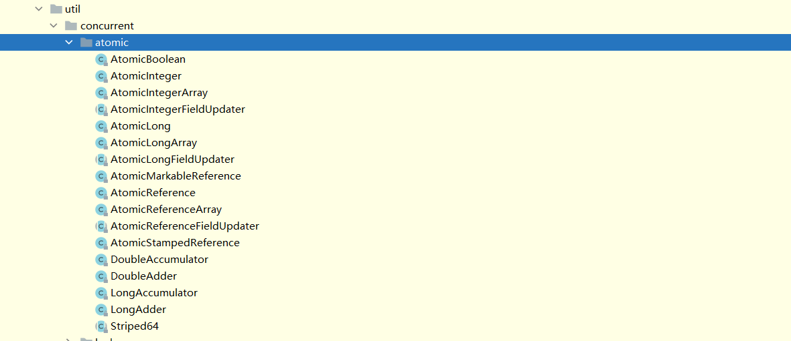

    2. 主要了解一下AtomicInteger

```java

public class MyTest2 {

    public static void main(String[] args) {
        AtomicInteger atomicInteger = new AtomicInteger(3);

        System.out.println(atomicInteger.get());//将值获取出来3
        System.out.println(atomicInteger.getAndIncrement());//将值获取出来并进行+1，此时返回的是没有自增的结果3
        System.out.println(atomicInteger.getAndSet(6));//此时获取的是旧的值4，并将该值设置为6
        System.out.println(atomicInteger.get());//此时获取的值为6
    }
}

```
    3. 了解一下getAndSet()方法
        1) 查看方法

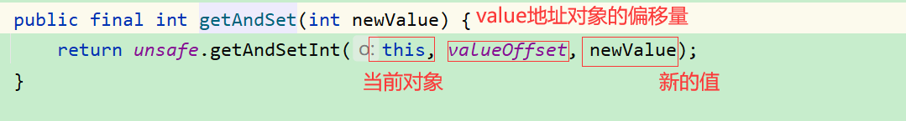

        2) 进入unsafe查看，该类未开源，所有只能查看反编译的结果。使用到循环，这也就应证了比较和交换是循环的直到成功
            在底层，CompareAndSwapInt是通过一条cpu指令完成的，保证了原子性

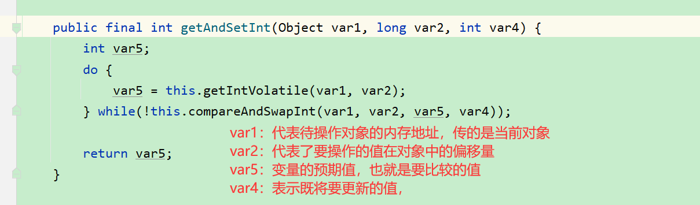

    4. CAS涉及的操作数
        <1> 需要被操作的内存值V

        <2> 需要进行比较的的值A

        <3> 需要进行写入的值B

        只有当V==A时，CAS才会通过原子操作的手段来讲V的值更新为B

    5. CAS存在的问题
        <1> 循环开销问题：在并发最大的情况下会导致线程一直自旋，因为对于原子的操作是在一个do...while循环中，从上面代码
                        可以一直到

        <2> 只能保证一个变量的原子操作：如：对于AtomicInterger就是对一个整形变量是一个原子操作，而如果想要实现多个整型
            变量的原子操作则用它就不行了，不过并发包中有一个能满足这种需求的类存在：AtomicReference

        <3> ABA问题
                1) 什么是ABA问题呢？
                    比如，一变量初始值为1，然后进行一个CAS更新操作，在CAS更新操作完成之前，另外一个线程对该变量进行修改
                    将1变为3，而后又将变量的值改回为1。这时之前的线程又回来了，它发现该变量的值没有发生改变(实际上其它
                    线程对它进行了修改只是还原了而已)。此时该CAS操作依然能够成功，从程序的正确性来讲其实这没啥问题，最终结果不会有啥影响，但是，从程序的语义角度则就不正确。因为这已经被其线程进行了修改。

                    解决该问题可以使用版本号的方式来实现，只要数据更改了，那么版本号就+1

                2) 例子描述:
                    小明去ATM取钱 在一台机器上取钱 100-50机器卡住了(100-50待操作)
                    去另外一台ATM机器上取了50 100-50=50这个操作执行成功
			        女盆友给他转了50 (50+50=100)
			        突然之前最先操作的机器 恢复了 出现ABA问题

## Future模式示例剖析与源码详解

    1. Future模式简介
        Future模式是重jdk1.5开始引入的。本质上来说，它可以使得一个任务异步执行，也就是说该任务执行之后，不论任务执行成
        功还是失败，我们能在未来的某一个时间获取到执行的结果。通俗的说，我们完成一个任务，正常情况需要等到任务执行完成才
        能获取到结果，但是在使用Future后，此任务会交给其他线程继续执行，而主线程可以继续向下执行，在未来的某个时间，我
        们能够获取到该任务的结果。

    2. 详细了解Future类的使用
        
        <1> 文档了解

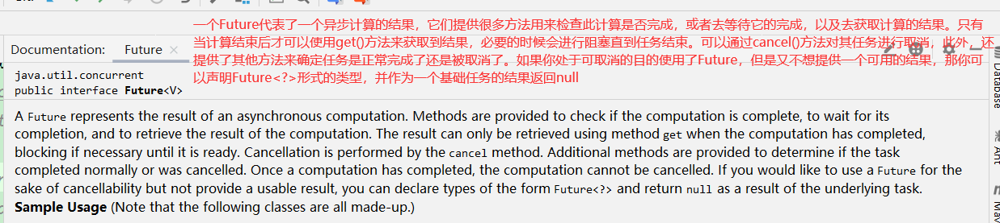

        <2> 方法实现了解

            1) 主要包含以下5个方法，Future是一个接口，所以具体实现我们还需关注实现类

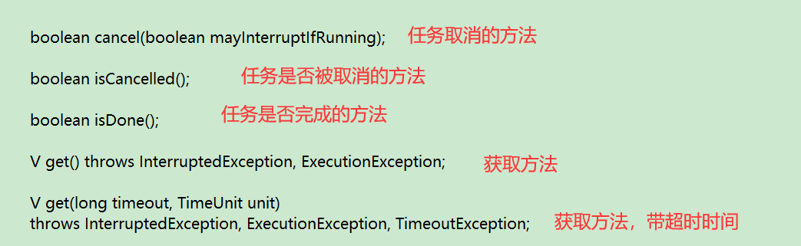

            2) 了解两个get方法

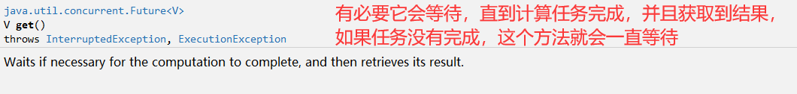

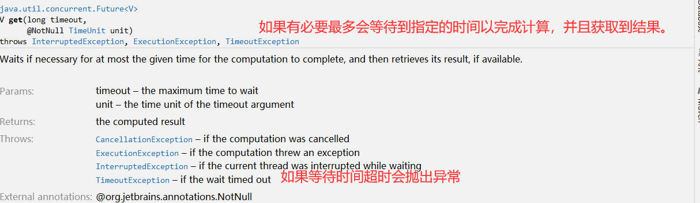

    3. Future实现类FutureTask

        <1> 查看源码，会发现FutureTask实现了RunnableFuture接口，而RunnableFuture又继承了Future<V>和Runnable，感兴
            趣的可以去查看源码，这里不在显示

        <2> FutureTask的两个重要的构造方法
            1) 相比之下，一个接受Runnable实例，一个接受的是Callable实例，当想要执行任务但是不需要得到返回结果，那么就
                用Runnable的构造方法，而如果需要有返回结果当然就使用Callable的构造方法

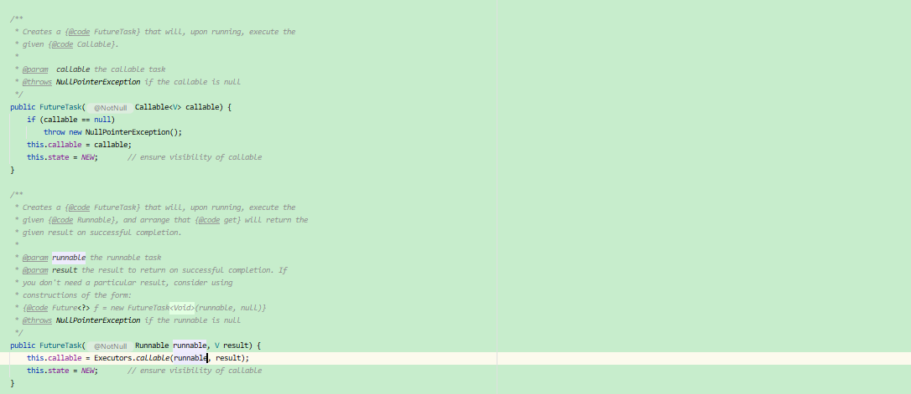

    
    4. 实例演示
        <1> 例子如下

```java
public class MyTest01 {

    public static void main(String[] args) {
        //需要有返回值
        Callable<Integer> callable = () -> {
            System.out.println("pre execution");
            int result = new Random().nextInt(500);
            System.out.println("post execution");
            return  result;
        };

        //构建FutureTask
        FutureTask<Integer> futureTask = new FutureTask <>(callable);

        //创建一个线程执行任务,futureTask底层继承了Runnable所以可以直接当做参数传入
        new Thread(futureTask).start();
        System.out.println("thread has started");
        //获取执行结果
        try {
            System.out.println("TaskResult: " + futureTask.get());;
        } catch (InterruptedException e) {
            e.printStackTrace();
        } catch (ExecutionException e) {
            e.printStackTrace();
        }

    }
}

```

        <2> 程序运行分析

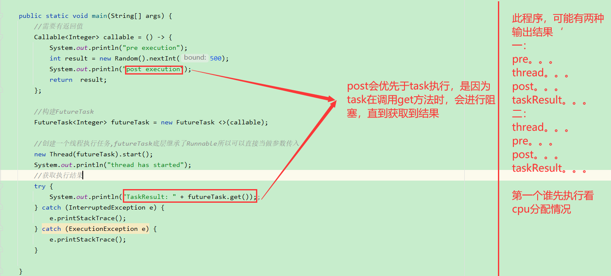

        <3> 改造程序，查看延时阻塞的效果
            此时，输出thread has started，pre execution之后，就阻塞了一会然后输出post execution，TaskResult: 432

```java
public class MyTest01 {

    public static void main(String[] args) {
        //需要有返回值
        Callable<Integer> callable = () -> {
            System.out.println("pre execution");
            //子线程休眠5秒
            Thread.sleep(5000);
            int result = new Random().nextInt(500);
            System.out.println("post execution");
            return  result;
        };

        //构建FutureTask
        FutureTask<Integer> futureTask = new FutureTask <>(callable);

        //创建一个线程执行任务,futureTask底层继承了Runnable所以可以直接当做参数传入
        new Thread(futureTask).start();
        System.out.println("thread has started");
        //获取执行结果
        try {
            //主线程休眠两秒
            Thread.sleep(2000);
            System.out.println("TaskResult: " + futureTask.get());;
        } catch (InterruptedException e) {
            e.printStackTrace();
        } catch (ExecutionException e) {
            e.printStackTrace();
        }

    }
}

```
    <4> 查看 get(long timeout, TimeUnit unit)效果。
        1) 只需要修改下面内容
            修改的意思就是只会等待3毫秒，3毫秒内没有获取到子线程的结果，就会抛出异常

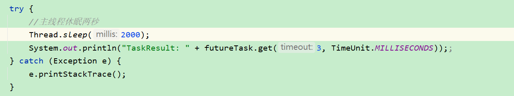

        2) 运行结果如下
            观察结果，可知：在抛出超时异常后，子线程最后仍然输出，也就是说继续执行了。这是因为主线程的异常不会干扰到
            FutureTask这个子线程的执行的


