# java并发

##  JMM和happen-before的规则

    1. JMM(Java Memory Model) Java 内存模型

    2. happen-before与JMM的问题
        <1> 变量的原子性问题

        <2> 变量的可见性问题

        <3> 变量修改时的时序性问题

        happen-before的概念:所谓happen-before就是指它前面的内容总是先于它后面的内容执行。如A happen-before B 
        那么就是指A在B之前执行

    3. Happen-before的重要规则
        <1> 顺序执行规则(限定在单线程)：执行线程的每一个动作都hppen-before它后面的动作

        <2> 隐式锁规则：unlock happen-before lock ,之前线程对于同步代码块的所有执行结果对于后续获取锁的线程来说都是可
            见的

        <3> volatile读写规则：对于一个volatile变量的写操作一定会happen-before后续对改变量的读操作

        <4> 多线程启动规则：Thread对象的start方法happen-before该线程中run方法的任何一个动作，包括在其中启动的任何子线
            程

        <5> 多线程的终止规则：一个线程启动了一个子线程，并且调用了子线程的join方法等待其结束，那么当子线程结束后，父线
            程接下来的所有操作都可以看到子线程run方法的执行结果

        <6> 线程的中断规则：可以调用interrupt方法来中断线程，这个操作是happen-before对该线程的中断检查(interrupted)


## CountDownLatch使用场景与示例分析
    1. 引入问题：
        有两个线程，一个线程必须在另外一个线程执行完成所有任务之后才能继续往下执行，可以如何实现呢？

        解决方案：
            使用Thread类中的join方法可以实现。

        此刻，问题又来了，如果在一个特定的条件下，如以下条件：有一个主服务，其下面包含着5个子服务，那么如何实现在这五个
        之服务执行到一半时（或者其他特定条件）则可以通知主服务向下执行呢？

        那么，此时我们就不能使用join来实现了。因为join只是在完成所有任务之后才能够通知父服务进行执行

        解决方案：
            使用CountDownLatch即可完成该需求

    2. 查看CountDownLatch的描述
        意思是一个同步辅助，允许一个或多个线程去等待，直到在其他线程中一组操作执行完成为止。（这就符合我们的需求）

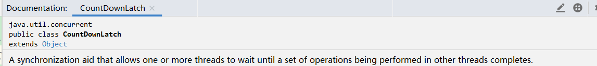

    3. 程序示例编写

```java
public class MyTest01 {

    public static void main(String[] args) {
        //创建CountDownLatch
        //参数3，表示线程在调用wait()之前，必须调用countDown()的次数（3次）
        CountDownLatch latch = new CountDownLatch(3);
        //创建3个线程
        IntStream.range(0,3).forEach(i -> new Thread(() -> {
            try {
                Thread.sleep(2000);
                System.out.println("111111");
            }catch (Exception e){
                e.printStackTrace();
            }finally {
                //调用countDown,latch必须要在finally中调用，确保出异常也能调用到
                latch.countDown();
            }
        }).start());
        //此刻子线程执行完毕
        System.out.println("子线程执行完毕啦。。。。");
        try {
            latch.await();
        }catch (Exception e) {
            e.printStackTrace();
        }
        System.out.println("主线程执行完毕啦。。。。");
    }
}

```
    4. 上述程序分析
        <1> 首先，我们对引用计数器（也就是countDown中的参数）进行分析。
            1) 就上述程序而言，只要调用了一次countDown()方法，那么改参数就会减1。而在上述例子中我们设置的参数与我们创
               建的线程数保持一致，也就是说，最终计数器会变为0。在变为0之后，计数器不会继续向下减。

        <2> 前面提到了计数器，那么计数器的作用是什么呢?
            1) 在调用coutDownLatch.await()方法时会检测计数器的值。如果计数器的值大于0，那么调用await()的线程就会进
               入阻塞状态。计数器等于0了则该await()立刻返回

            2) 也就是说，如果我们在创建对象时，指定参数为4，那么最终计数器的值为1，调用的子线程就会进入阻塞状态

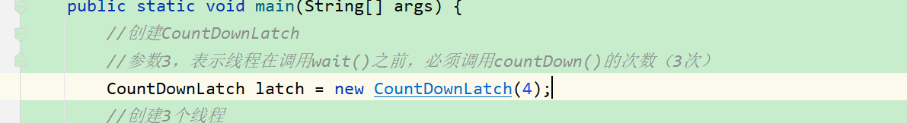

            3) 运行结果一致处于阻塞状态，导致最后的主线程没有执行

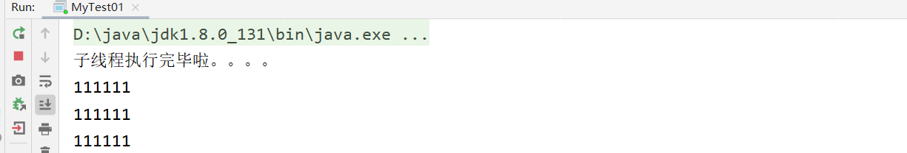

        <3> 回到之前程序，查看结果，这样的结果貌似使用Thread.join()也能实现，实际并非如此，如果我们在添加后续代码
            那么join()就实现不了。因为join()必须在所有内容执行完才能通知调用主线程

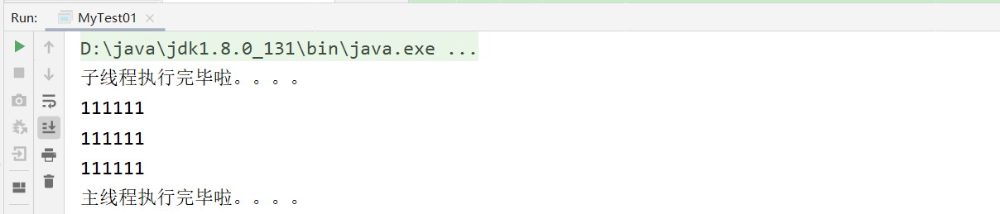

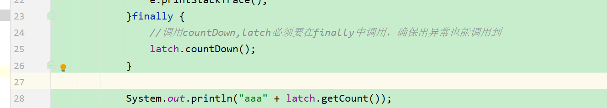

    3. 详解CoutDownLatch

        <1> await()方法详解
            1) 底层是调用sync的方法，该类继承了AQS。详细的内容不在进行描述，感兴趣的可以继续探讨

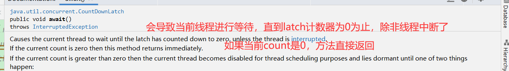

        <2> 对于await()方法还有一个重载的方法await(long timeout, TimeUnit unit)。该方法的作用是在上述情况中如果
            count>0会阻塞，而该方法表示在到达指定的时间后，阻塞结束，会继续向下执行

## CyclicBarrier透彻分析
    1. CyclicBarrier使用场景
        <1> 假设有4个线程，只有当4个线程都到达了内存屏障之后才会开始执行。也就是说，如果线程1到达了，那么线程1会阻塞
            线程2，线程3也是如此,只有当线程4，即最后一个线程到达内存屏障，那么这4个线程才会一起冲破屏障，继续执行。

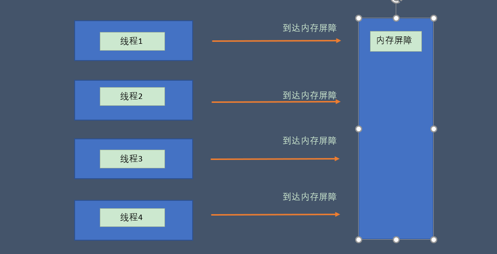

        <2> 在了解了CyclicBarrier的使用场景之后，我们将它与CoutDownLatch进行一个对比
            1) CoutDownLatch是有主线程和子线程之分的，而CyclicBarrier没有主线程与子线程之分

            2) 两者都有计数器这个东西，但是CoutDownLatch的计数器在减到0后，不会重置。而CyclicBarrier的计数器在减到
               0后，会重置。(即如果count为4，当4个线程到达内存屏障执行后，count会重新置为4)

    2. CyclicBarrier源码注释

        <1> CyclicBarrier描述

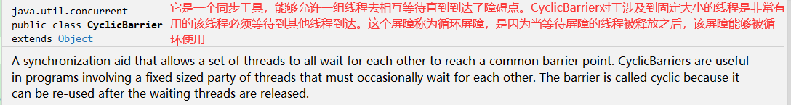

    3. 程序例子
        <1> 例子如下所示

```java

public class MyTest02 {
    public static void main(String[] args) {
        //创建CyclicBarrier
        CyclicBarrier cyclicBarrier = new CyclicBarrier(4);
        //该参数代表线程数量，必须在障碍被释放之前调用await方法
        //创建3个线程
        for (int i = 0; i < 4; i++) {
            new Thread(() -> {
                try {
                    Thread.sleep((long) (Math.random() * 2000));
                    Random random = new Random();
                    int result = random.nextInt(500);
                    System.out.println("AAA" + result);
                    cyclicBarrier.await();
                    System.out.println("BBB" + result);
                }catch (Exception e) {
                    e.printStackTrace();
                }
            }).start();
        }
    }
}

```

        <2> 运行结果
            1) 此结果，再输出时，控制台会出先以下情况：首先前面的都是一个一个慢慢输出，当AAA324出现后，立刻下面的内容
               全部输出。这就是因为要等到最后一个线程到达后才会一次性冲破屏障的结果

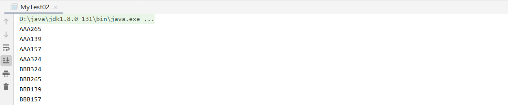

        <3> 分析  cyclicBarrier.await();    此处以上述例子为例
            1) 有两层含义：
                * 先检测障碍前是否有4个线程，如果没有就会进入阻塞

                * 如果检测到有4个线程，那么这四个线程就会冲破障碍然后执行

    4. 例子改进
        <1> 改进如下

```java

public class MyTest02 {
    public static void main(String[] args) {
        //创建CyclicBarrier
        CyclicBarrier cyclicBarrier = new CyclicBarrier(4);
        //该参数代表线程数量，必须在障碍被释放之前调用await方法
        //创建3个线程
        for(int j = 0 ; j < 2; j++) {
            for (int i = 0; i < 4; i++) {
                new Thread(() -> {
                    try {
                        Thread.sleep((long) (Math.random() * 2000));
                        Random random = new Random();
                        int result = random.nextInt(500);
                        System.out.println("AAA" + result);
                        cyclicBarrier.await();
                        System.out.println("BBB" + result);
                    }catch (Exception e) {
                        e.printStackTrace();
                    }
                }).start();
            }
        }
    }
}

```

        <2> 运行结果如下

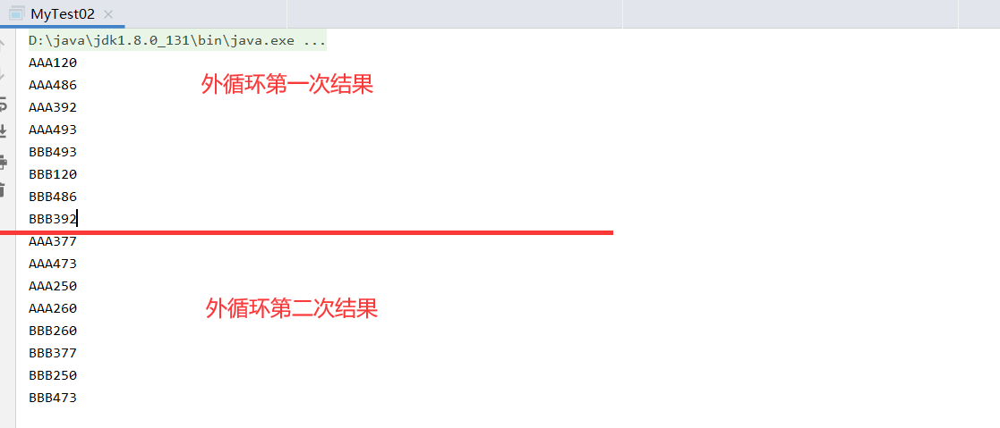

    5. CyclicBarrier的第二个构造方法，传递一个Runnable对象

        <1> 如下所示

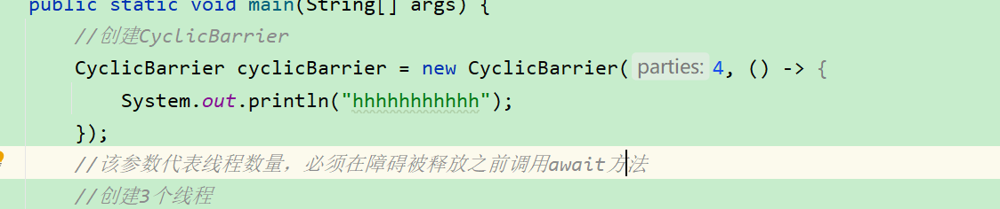

        <2> 运行结果
            
            * 查看结果，我们可以得出结论：该构造方法的Runnable对象会在所有线程冲破屏障向下执行之前执行

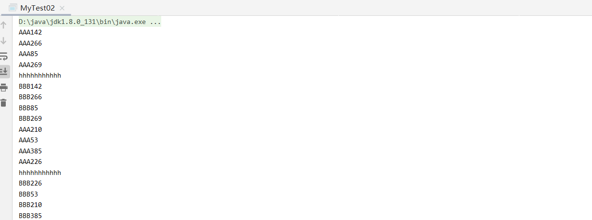
 
            


