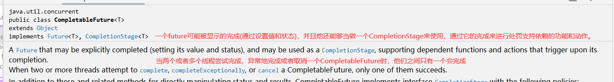

# java并发

## CompletableFuture示例剖析与源码解读

    1. 之前学习过Future，但是我们知道有一个明显的缺点，就是当我们调用get()方法获取结果时，会进行阻塞，直到获得结果为止
        那么，为了解决这个阻塞问题，在jdk1.8之后，jdk提供了一个CompletableFuture解决该问题

    2. 详解CompletableFuture
        <1> 查看CompletableFuture源码，我们会发现，它继承了Future和CompletionStage,由此可见是在Future的基础上进行了
            优化，那么CompletionStage又是个什么东西呢？


            
            1) 了解CompletionStage
                
                * 查看注释了解功能，也就是说CompletionStage,一个任务会分为多个阶段执行，当第一个阶段执行完之后，接着
                  就会执行第二个阶段，以此类推，每一个阶段就称为CompletionStage。它能按阶段处理任务


 
        <2> 之前的FutureTask,在get时会阻塞，那么也就是说期间不能进行其他操作，但是有时，我们希望在任务执行过程中，能够
            进行状态干预，CompletableFuture也能完成按阶段的处理任务。CompletableFuture能够完成这一点



    3. 程序实践
        <1> 演示任务异步执行之后再次执行一个异步任务

```java
public class MyTest02 {

    public static void main(String[] args) {
        //程序一：
        //此方法没有返回值
        String result = CompletableFuture.supplyAsync(() -> "hello")
                .thenApplyAsync(value -> value + "world").join();
        //此程序只是用于演示异步执行任务之后继续再执行一个一步任务
        System.out.println(result);//输出helloworld

        //同时CompletableFuture还提供另一种不返回结果的分阶段执行的API
        String join = CompletableFuture.runAsync(() -> System.out.println("hello")).thenApplyAsync(value -> value + "AAA").join();
        System.out.println(join);
        //由于runAsync没有返回值，所以直接输出，在执行该任务后执行下一个任务所以为nullAAA
    }
}

```

    <2> thenAccept()方法执行

```java

    //程序二：可以对结果做消费处理，而不返回结果。
    @Test
    public void test01(){
        //thenAccept(Consumer<? super T> action),表示对结果的消费，没有返回值
        CompletableFuture.supplyAsync(() -> "小明")
                .thenAccept(value -> System.out.println(value + "真帅"));
        //输出小明真帅
    }   

```

    <3> 对多个CompletionStage的结果进行转换,thenCombine()

```java

  //程序三：对多个CompletionStage的结果进行转换
    @Test
    public void test02() {
        //thenCombine()将两个CompletionStage进行合并，然后指定合并之后的行为
        String result = CompletableFuture.supplyAsync(() -> {
            try {
                Thread.sleep(2000);
            } catch (Exception e) {
                e.printStackTrace();
            }
            return "小花";
        }).thenCombine(CompletableFuture.supplyAsync(() -> {
            try {
                TimeUnit.MILLISECONDS.sleep(1000);//休眠
            } catch (Exception e) {
                e.printStackTrace();
            }
            return "爱吃鱼";
            //定合并之后的行为,(r1, r2) -> r1 + "" + r2
        }), (r1, r2) -> r1 + "" + r2).join();

        System.out.println(result);
    }
```

        <4> 增强Future的功能实现。上面已经提到，FutureTask的get()方法在获取结果时，会进行阻塞，直到获取到结果。
            那么CompletableFuture如何实现get()方法不阻塞呢?

            1) whenComplete()方法

```java
  //whenComplete()当任务执行完会执行的动作
    @Test
    public void test03() {
        CompletableFuture <Void> future = CompletableFuture.runAsync(() -> {
            try {
                Thread.sleep(2000);
            } catch (InterruptedException e) {
                e.printStackTrace();
            }
            System.out.println("任务正在执行。。。");
        });

        future.whenComplete((t, action) -> System.out.println("任务执行完成。。。"));

        System.out.println("主线程执行已完成。。。");

        try {
            TimeUnit.MILLISECONDS.sleep(7000);//线程阻塞，方便查看效果
        } catch (InterruptedException e) {
            e.printStackTrace();
        }
    }

```
            2) 查看执行结果，执行完成结果发现，直接输出“主线程执行已完成。。。”，说明在获取任务的结果的时候，没有进行阻
                塞，过了一会就输出了"任务正在执行。。。"，"任务执行完成。。。"


## TreadLocal底层源码的分析

    1. 概述
        <1> 本质上，ThreadLocal是通过空间来换时间，从而实现每个线程中都会有一个变量的副本，这样每个线程都会操作该副
            本，从而完全规避了多线程并发问题

        <2> ThreadLocal主要使用用的方法有set和get，底层是通过一个静态内部类Entry<K,V>来存储的，set方法会将我们创建的
            ThreadLocal对象作为Entry的键，将我们所设置的值作为Entry的值。ThreadLocal.ThreadLocalMap.Entry
            
        <3> 然而，我们需要知道Thread类是如何与ThreadLocal进行关联的呢？

            在Thread类中有一个成员变量，threadLocals，这是一个ThreadLocal.ThreadLocalMap类型，该成员变量是ThreadLocal类中的静态内部类类型。两者就是通过threadLocals实现交互的关系以及数据的传递

        <4> java中存在的四种类型的引用
            1) 强引用：在gc时，引用不会被回收的引用。比如new出来的对象

            2) 软引用：在gc时，如果内存足够，就不会进行回收，如果不够则会进行回收的引用

            3) 弱引用：在下一次gc时，会被gc垃圾回收的引用，前提是没有强引用执行它

            4) 虚引用：表示并不会指向一个对象，会接受到通知，进行一些处理的引用

            软引用和弱引用以及虚引用都会继承一个父类Reference

        <5> 分析set方法
            1) 当调用threadlocal的set方法时，先获取到了当前的线程，返回的是thread对象，然后通过getMap方法获得到当前
                thread的threadlocalmap，然后调用threadlocalmap的set进行赋值，如果map没有初始化，就新建map。


        <6> ThreadLocal中的ThreadLocal.ThreadLocalMap.Entry，他继承了WeakReference(弱引用)，这是为什么呢？这就涉
            及到ThreadLocal的内存泄漏的问题了

## ThreadLocal的内存泄漏
    1. ThreadLocal内存泄漏原理
        <1> 上面提到在Entry中继承了软引用，那么问题来了？如果继承强引用会有怎样的结果呢？下面我们通过内存模型来对它进行
            分析。

            1) 首先查看一下Thread与ThreadLocal之间的内存布局


            
            2) 源码中Entry继承了WeakReference，同时将ThreadLocal传进去了，也就是说ThreadLocal作为一个key存在


            3) 如果图中的弱引用为强引用，如果说，当某一时刻，持有ThreadLocal的对象不需要这个ThreadLocal，那么堆内存中
                的ThreadLocal对象也就被销毁了，所以ThreadLocal Ref就变成了null，就是说引用也就消失了，那么也就是说对
                象没有了，然而并非如此，因为我们假设了某个key使用一个强引用指向它，所以它不会被回收，那么就会造成堆中的
                ThreadLocal永远不会被释放，也就是说Entry数组中的entry也永远得不到释放，也就是说entry只会增加而不会减
                少。这也就导致了内存泄漏(无意义的ThreadLocal一直存在，没有被回收)


        <2> 在分析了入股为强引用后，我们来分析弱引用的情况

            1) 同样的，假设某一时刻持有ThreadLocal的对象不需要这个ThreadLocal，那么堆内存中的ThreadLocal对象也就被
                销毁了，所以ThreadLocal Ref就变成了null，就是说引用也就消失了，那么也就是说对象没有了，因为是key用弱
                引用指向ThreadLocal，所以在下一次gc的时候堆中的ThreadLocal就会被释放。被回收之后key就为null，此时就
                又出现了一个问题，value依然是存在的，那么entry数组中就有可能存在很多key=null，value为我们设置的值的
                entry对象。很显然，如果不做处理value又可能造成内存泄漏。


            2) 那么可以将value也设置为弱引用吗？显然不行，这样很可能导致value被回收，而key存在，获取不到值，那么该如何
                处理呢？ThreadLocal的设计者已经帮我们规避了该问题，在set和get值时，不是简单的设置值，而是会进行一个key是否等于null的判断，如果为null就会将其删除。查看源码观察


            3) 在上述方法中会调用expungeStaleEntry()去完成真正的删除操作

    2. 一般在使用ThreadLocal时我们会遵循以下方式
        <1> 将ThreadLocal声明为static的成员变量，这是因为该变量是针对一个线程内所有操作共享的

        <2> 如果不需要ThreadLocal会在finally块中调用ThreadLocal的remove方法

        <3> 一个threadlocal只能存储一个object对象，如果要存储多个，就需要多个threadlocal。


    3. 演示：ThreadLocal会单独为每一个线程设置一个变量副本，其他线程不能访问
        <1> 程序如下所示

```java

public class ThreadLocalTest {
    private static String strLabel;
    private static ThreadLocal<String> threadLabel = new ThreadLocal<>();

    public static void main(String... args) {
        strLabel = "main";
        threadLabel.set("main");
        Thread thread = new Thread() {
            @Override
            public void run() {
                super.run();
                strLabel = "child";
                threadLabel.set("child");
                System.out.println("threadLabel = " + threadLabel.get());
            }
        };
        thread.start();
        try {
            // 保证线程执行完毕
            thread.join();
        } catch (InterruptedException e) {
            e.printStackTrace();
        }
        System.out.println("strLabel = " + strLabel);
        System.out.println("threadLabel = " + threadLabel.get());
    }
}

```
        <2> 结果如下所示


        
                